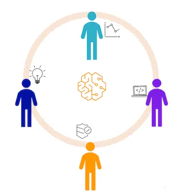
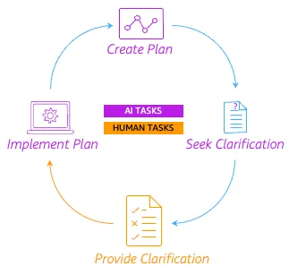
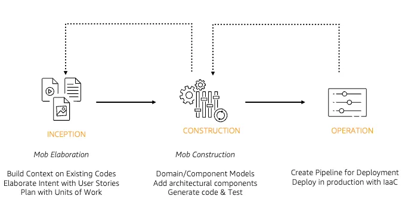

# Ciclo de Vida de Desenvolvimento Dirigido por IA: Reimaginando a Engenharia de Software (AI-Driven Development Life Cycle: Reimagining Software Engineering)

**Author:** Raja SP, Amazon Web Services  
**Source:** https://aws.amazon.com/blogs/devops/ai-driven-development-life-cycle/  
**Setup:** https://github.com/awslabs/aidlc-workflows  
**Adaptation:** Ricardo de Luna Galdino, EngSoft Learn 
**Download:** [ai-dlc_aws-article_raja-sp.pt-br.pdf](pdf/ai-dlc_aws-article_raja-sp.pt-br.pdf)

Líderes de negócios e tecnologia buscam constantemente melhorar a produtividade, aumentar a velocidade, promover a experimentação, reduzir o tempo de lançamento no mercado (TTM) e aprimorar a experiência do desenvolvedor. Esses objetivos guiam a inovação nas práticas de desenvolvimento de software. Hoje, essa inovação é impulsionada pela inteligência artificial. Ferramentas baseadas em IA generativa, como [Amazon Q Developer](https://aws.amazon.com/q/developer/) e [Kiro](https://kiro.dev/), já começaram a revolucionar como o software é criado. Atualmente, as organizações utilizam a IA de duas maneiras principais: o **desenvolvimento assistido por IA**, onde a IA melhora tarefas específicas como documentação e testes; e o **desenvolvimento autônomo por IA**, onde a expectativa é que a IA gere aplicações inteiras sem intervenção humana. Ambas as abordagens têm entregado resultados abaixo do esperado em termos de velocidade e qualidade, e é isso que o AI-DLC busca resolver.

## Por que precisamos de uma abordagem transformadora para a IA no software? (Why do we need a transformative approach to AI in software?)

Nossos métodos atuais de desenvolvimento foram criados para processos longos e guiados por humanos, onde product owners, desenvolvedores e arquitetos gastam a maior parte do tempo em atividades que não são o núcleo do desenvolvimento, como reuniões de planejamento e outros rituais do ciclo de vida tradicional (SDLC). Tentar encaixar a IA apenas como um assistente limita o seu potencial e reforça ineficiências do passado. Para extrair o verdadeiro poder da IA e atingir nossas metas de produtividade, precisamos repensar completamente o processo de desenvolvimento de software.

Para alcançar resultados transformadores, precisamos colocar a IA como uma colaboradora central na equipe e utilizar suas capacidades em todas as etapas do ciclo de desenvolvimento. É por isso que apresentamos o [Ciclo de Vida de Desenvolvimento Dirigido por IA (AI-Driven Development Lifecycle - AI-DLC)](https://prod.d13rzhkk8cj2z0.amplifyapp.com/), uma nova metodologia criada para incorporar as habilidades da IA na base da engenharia de software.

## O que é o AI-DLC? (What is AI Driven Development Life Cycle?)

O AI-DLC é uma abordagem transformadora e focada em IA, que se baseia em duas frentes poderosas:

- **Execução Guiada por IA com Supervisão Humana (AI Powered Execution with Human Oversight)**: A IA cria planos de trabalho detalhados, faz perguntas para esclarecimento e repassa as decisões críticas para os humanos. Isso é fundamental, pois apenas os humanos possuem o entendimento do contexto e dos requisitos de negócios necessários para tomar boas decisões.
- **Colaboração Dinâmica da Equipe (Dynamic Team Collaboration)**: Enquanto a IA cuida das tarefas repetitivas, a equipe se reúne para resolver problemas em tempo real, ter ideias criativas e tomar decisões rapidamente. Essa transição do trabalho isolado para o trabalho em equipe com alta energia acelera a inovação e a entrega.

  

Essas duas frentes permitem que você entregue software mais rápido, sem abrir mão da qualidade.

## Como o AI-DLC funciona? (How does AI-DLC work?)

Em sua essência, o AI-DLC funciona permitindo que a IA inicie e direcione os fluxos de trabalho através de um novo modelo mental:

  

Nesse padrão, a IA cria um plano, faz perguntas para entender melhor o contexto e só implementa as soluções após a validação humana. Isso se repete rapidamente para todas as atividades do SDLC, garantindo uma visão única e unificada para o desenvolvimento.

Com esse modelo mental como base, o desenvolvimento no AI-DLC ocorre em três fases diretas:

- Na **Fase de Iniciação (Inception phase)**, a IA transforma a intenção de negócio em requisitos detalhados, histórias e unidades através do "Mob Elaboration" – onde a equipe inteira valida ativamente as propostas e perguntas da IA.
- Na **Fase de Construção (Construction phase)**, utilizando o contexto validado da iniciação, a IA propõe uma arquitetura lógica, modelos de domínio, código e testes através do "Mob Construction" – onde a equipe fornece esclarecimentos sobre decisões técnicas e escolhas de arquitetura em tempo real.
- Na **Fase de Operações (Operations phase)**, a IA aplica o contexto acumulado nas fases anteriores para gerenciar infraestrutura como código (IaC) e implantações, sob a supervisão da equipe.

Cada fase gera um contexto mais rico para a próxima, permitindo que a IA ofereça sugestões cada vez mais precisas.

  

A IA salva e mantém um contexto persistente em todas as fases, armazenando planos, requisitos e artefatos de design diretamente no repositório do projeto, o que garante a continuidade fluida do trabalho entre várias sessões.

O [AI-DLC introduz novos rituais e terminologias](https://prod.d13rzhkk8cj2z0.amplifyapp.com/) para refletir sua abordagem colaborativa e dirigida por IA. Os 'sprints' tradicionais são substituídos por **'bolts'** – ciclos de trabalho mais curtos e intensos medidos em horas ou dias, não semanas; os Épicos (Epics) são substituídos por **Unidades de Trabalho (Units of Work)**. Essa mudança destaca o foco do método em velocidade e entrega contínua. De forma semelhante, outros termos ágeis conhecidos são reinventados para alinhar-se ao fluxo focado em IA, criando um vocabulário que representa melhor essa metodologia inovadora.

## Quais são os benefícios desta metodologia? (What are the benefits of this methodology?)

- **Velocidade (Velocity)**: O benefício principal do AI-DLC é a aceleração do desenvolvimento. Como a IA gera e refina rapidamente os artefatos (requisitos, código, testes), a equipe consegue concluir em poucas horas ou dias tarefas que antes levavam semanas.
- **Inovação (Innovation)**: Ao transferir o trabalho pesado para a IA, os desenvolvedores ganham um tempo significativo para explorar soluções criativas e inovar.
- **Qualidade (Quality)**: Através de esclarecimentos contínuos, as equipes constroem exatamente o que foi planejado, em vez de uma interpretação abstrata da IA. A IA melhora a qualidade aplicando constantemente os padrões da organização (padrões de design, segurança) e gerando testes abrangentes.
- **Capacidade de Resposta ao Mercado (Market Responsiveness)**: Os ciclos rápidos do AI-DLC permitem adaptações muito ágeis aos feedbacks dos usuários e demandas do mercado.
- **Experiência do Desenvolvedor (Developer Experience)**: O foco do desenvolvedor muda de tarefas rotineiras e repetitivas para a resolução crítica de problemas. O esforço cognitivo diminui e a satisfação aumenta ao ver diretamente como o trabalho gera valor para o negócio.

## Como eu começo com isso? (How do I get started with this?)

Comece sua jornada com o AI-DLC através de três caminhos: Leia o [White Paper do AI-DLC](https://prod.d13rzhkk8cj2z0.amplifyapp.com/) completo, explore como o [Amazon Q Developer](https://docs.aws.amazon.com/amazonq/latest/qdeveloper-ug/context-project-rules.html) e o [Kiro custom workflows](https://kiro.dev/docs/steering/) podem te ajudar a implementar o AI-DLC na sua organização, ou entre em contato com sua equipe da AWS para discutir como o método pode ser adaptado para as suas necessidades específicas.

O futuro do desenvolvimento de software já chegou. Estamos entusiasmados em ajudar você a usar a IA não apenas para construir sistemas mais rápidos, mas para manter a qualidade e fidelidade através da supervisão humana. Comece sua jornada AI-DLC hoje!

---

  

### Raja SP
Raja é um Principal Solutions Architect na AWS, onde lidera os Programas de Transformação de Desenvolvedores. Ele já trabalhou com mais de 100 grandes clientes, ajudando-os a projetar e entregar sistemas críticos baseados em arquiteturas modernas. À medida que a IA Generativa remodela o desenvolvimento de software, Raja e sua equipe criaram o AI Driven Development Lifecycle (AI-DLC) — uma metodologia AI-native de ponta a ponta que reimagina como grandes equipes constroem colaborativamente softwares de nível de produção na era da IA.
