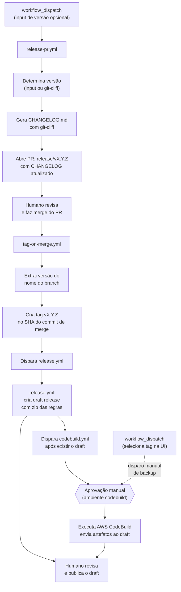
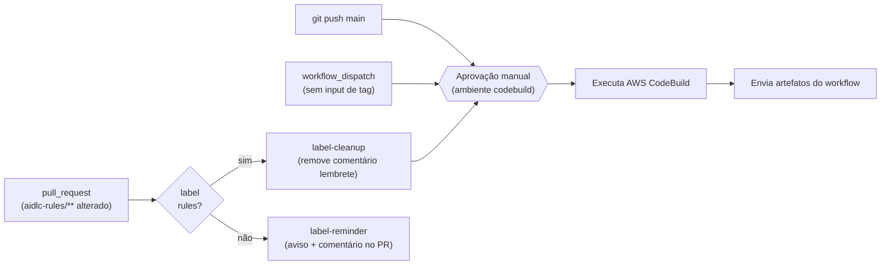
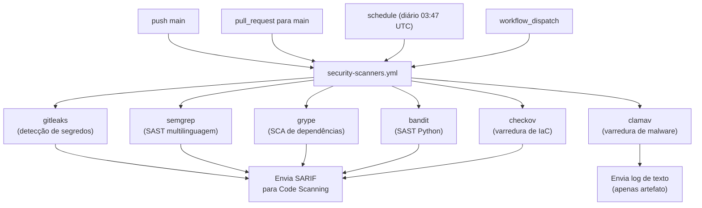
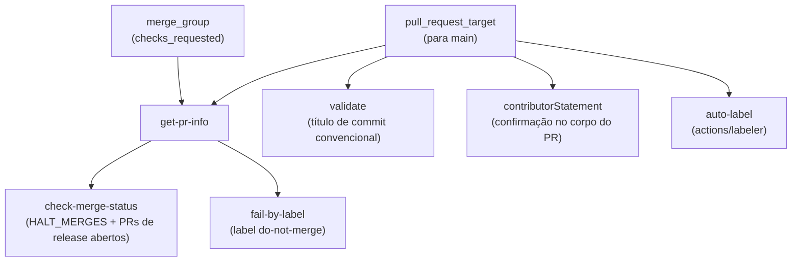

# Guia Administrativo


**Author:** Raja SP, AWS Labs <br>
**Source:** https://github.com/awslabs/aidlc-workflows <br>
**Adaptation:** Ricardo de Luna Galdino, EngSoft Learn<br>
**Download:** [administrative-guide.pt-br.pdf](pdf/administrative-guide.pt-br.pdf)

Este guia documenta a infraestrutura de CI/CD, os GitHub Workflows, os ambientes protegidos, os segredos, as variáveis, as permissões e o processo de release do repositório `awslabs/aidlc-workflows`.

**Público-alvo:** Administradores de repositório, mantenedores e agentes de codificação com IA que trabalham neste repositório.

**Documentação relacionada:**

- [Guia do Desenvolvedor](developers-guide.pt-br.md) — Execução de builds localmente (CodeBuild + `act`)
- [Diretrizes de Contribuição](../CONTRIBUTING.md) — Processo de contribuição e convenções
- [README](../README.md) — Configuração e uso para o usuário final

---

## Índice

- [Visão Geral do Repositório](#visão-geral-do-repositório)
- [Arquitetura de CI/CD](#arquitetura-de-cicd)
- [Referência de Workflows](#referência-de-workflows)
  - [Workflow de Release PR](#workflow-de-release-pr-release-pryml)
  - [Workflow de Tag Release](#workflow-de-tag-release-tag-on-mergeyml)
  - [Workflow do CodeBuild](#workflow-do-codebuild-codebuildyml)
  - [Workflow de Release](#workflow-de-release-releaseyml)
  - [Workflow de Validação de Pull Request](#workflow-de-validação-de-pull-request-pull-request-lintyml)
  - [Workflow de Scanners de Segurança](#workflow-de-scanners-de-segurança-security-scannersyml)
- [Ambientes Protegidos](#ambientes-protegidos)
- [Segredos e Variáveis](#segredos-e-variáveis)
- [Modelo de Permissões](#modelo-de-permissões)
- [Postura de Segurança](#postura-de-segurança)
  - [Requisitos para Achados de Segurança](#requisitos-para-achados-de-segurança)
- [Propriedade de Código](#propriedade-de-código)
- [Processo de Release](#processo-de-release)
- [Configuração do Changelog](#configuração-do-changelog)
- [Atualizando Versões Fixadas](#atualizando-versões-fixadas)

---

## Visão Geral do Repositório

Este repositório publica a metodologia **AI-DLC (AI-Driven Development Life Cycle)** como um conjunto de arquivos de regras markdown em `aidlc-rules/`. A infraestrutura de CI/CD gerencia:

- **Integração contínua** via AWS CodeBuild (avaliação e relatórios)
- **Distribuição de releases** via GitHub Releases (arquivos de regras compactados)
- **Geração de changelog** via git-cliff (changelog-first: atualizado antes do release, incluído no commit com tag)

```text
awslabs/aidlc-workflows/
├── .github/
│   ├── CODEOWNERS
│   ├── ISSUE_TEMPLATE/           # Modelos de bug, feature, RFC, docs
│   ├── labeler.yml               # Regras de auto-label (mapeamento caminho → label)
│   ├── pull_request_template.md  # Modelo de PR com declaração do contribuidor
│   └── workflows/
│       ├── codebuild.yml         # CI via AWS CodeBuild
│       ├── pull-request-lint.yml # Validação de PR (título, labels, gates de merge)
│       ├── release.yml           # GitHub Release no push de tag
│       ├── release-pr.yml        # PR de Changelog antes do release
│       ├── security-scanners.yml # Suite de varredura de segurança (6 scanners)
│       └── tag-on-merge.yml      # Auto-tag no merge do release PR
├── .claude/
│   └── settings.json             # Configurações compartilhadas do projeto Claude Code
├── aidlc-rules/                  # O produto distribuível
│   ├── aws-aidlc-rules/          # Regras de workflow principais
│   └── aws-aidlc-rule-details/   # Regras detalhadas por fase
├── cliff.toml                    # Configuração do changelog com git-cliff
├── docs/
│   ├── ADMINISTRATIVE_GUIDE.md   # Este arquivo
│   └── DEVELOPERS_GUIDE.md       # Instruções de build local
└── scripts/
    └── aidlc-evaluator/          # Framework de avaliação (em desenvolvimento)
```

---

## Arquitetura de CI/CD

Seis workflows formam dois pipelines distintos, uma suite de varredura de segurança e um gate de validação de pull request:

### Pipeline 1: Release (changelog-first)



O fluxo de release é **changelog-first**: o CHANGELOG é atualizado *antes* da criação da tag, de forma que o commit com tag sempre contém sua própria entrada de changelog. O fluxo tem três pontos de interação humana:

1. **Fazer merge do PR de release** — revisa o changelog e aciona a criação automática da tag
2. **Aprovar o ambiente CodeBuild** — controla o acesso às credenciais AWS para o build
3. **Publicar o draft release** — revisa os artefatos e torna o release público

`tag-on-merge.yml` dispara explicitamente `release.yml` e `codebuild.yml` via `gh workflow run --ref vX.Y.Z` após criar a tag. Os disparos são **sequenciais**: `release.yml` é executado primeiro e monitorado até a conclusão para que o draft release exista antes de `codebuild.yml` enviar os artefatos. Isso é necessário porque tags criadas com `GITHUB_TOKEN` não disparam eventos `on: push: tags` — mas `workflow_dispatch` está isento dessa limitação. Ambos os workflows também mantêm `push: tags: v*` como fallback para pushes manuais de tags. O workflow `codebuild.yml` requer **aprovação manual** via o ambiente protegido `codebuild` antes do build prosseguir. A etapa de upload lida com todos os estados do release de forma resiliente:

- **Draft existente** (caso normal) — `release.yml` termina em ~30s criando o draft; o CodeBuild leva minutos, então o draft está pronto quando os artefatos são enviados
- **Sem release ainda** (codebuild terminou primeiro) — cria um draft com os artefatos do build; `release.yml` o atualizará depois
- **Já publicado** (nova execução) — tenta substituir os artefatos, avisa gentilmente se forem imutáveis

**Estratégia de backup:** Se a execução do CodeBuild disparada pela tag falhar ou for bloqueada, um administrador pode disparar manualmente o workflow via `workflow_dispatch` e selecionar a tag `v*` no seletor de branch/tag da UI do GitHub. Como `github.ref` é resolvido para a tag selecionada, a etapa de upload é ativada automaticamente.

### Pipeline 2: Integração Contínua



### Pipeline 3: Varredura de Segurança



Todos os seis jobs de scanner são executados em paralelo. Cada scanner (exceto ClamAV) produz um relatório SARIF enviado tanto para o GitHub Code Scanning (aba Security) quanto como artefato de workflow para download. Todos os scanners usam um **padrão de falha adiada**: a varredura é executada até o final, os resultados são sempre enviados, e somente então o job falha se os achados excederem o limite configurado. Veja a referência do [Workflow de Scanners de Segurança](#workflow-de-scanners-de-segurança-security-scannersyml) para detalhes.

### Pipeline 4: Validação de Pull Request



`pull-request-lint.yml` é executado em todos os PRs direcionados a `main` e nas verificações da fila de merge. Ele impõe quatro gates (títulos de PR no formato de commit convencional, a declaração do contribuidor do modelo de PR, um mecanismo de bloqueio de merge configurável e uma verificação de label do-not-merge) e aplica labels automaticamente com base nos caminhos dos arquivos alterados. O workflow usa `pull_request_target` (não `pull_request`) para que seja executado no contexto do branch base — isso é seguro porque nunca faz checkout nem executa código do PR, e o job `auto-label` usa `actions/labeler` que apenas lê caminhos de arquivos pela API.

---

## Referência de Workflows

### Workflow de Release PR (`release-pr.yml`)

| Propriedade     | Valor                                              |
| --------------- | -------------------------------------------------- |
| **Arquivo**     | `.github/workflows/release-pr.yml`                 |
| **Gatilho**     | `workflow_dispatch` com input opcional de `version` |
| **Ambiente**    | *(nenhum)*                                         |
| **Runner**      | `ubuntu-latest`                                    |

**Propósito:** Gera um `CHANGELOG.md` atualizado a partir de commits convencionais usando git-cliff, escreve a versão do release em `aidlc-rules/VERSION` e abre um PR no branch `release/vX.Y.Z`. Este é o primeiro passo no fluxo de release changelog-first. A atualização de `aidlc-rules/VERSION` garante que o PR toque em `aidlc-rules/`, o que aciona o filtro de caminho de `codebuild.yml` e o auto-label `rules`.

**Job: `release-pr` ("Create Release PR")**

| Etapa | Nome                            | Ação                                                                                                                                                                                    |
| ----- | ------------------------------- | --------------------------------------------------------------------------------------------------------------------------------------------------------------------------------------- |
| 1     | Checkout do código              | `actions/checkout` com `fetch-depth: 0` (histórico completo para git-cliff)                                                                                                             |
| 2     | Instalar git-cliff              | `orhun/git-cliff-action` para disponibilizar o CLI                                                                                                                                      |
| 3     | Determinar versão               | Usar `inputs.version` (com validação semver) ou `git-cliff --bumped-version` para auto-detecção; fallback para bump de patch a partir da última tag                                    |
| 4     | Verificar se a tag não existe   | Falhar cedo se a tag alvo já existir                                                                                                                                                    |
| 5     | Gerar changelog                 | `orhun/git-cliff-action` com `--tag vX.Y.Z` para gerar `CHANGELOG.md`                                                                                                                  |
| 6     | Criar PR de release             | Escrever versão em `aidlc-rules/VERSION`, verificar se o branch não existe, fazer commit, push do branch `release/vX.Y.Z` e abrir PR (com labels `release` e `rules` se existirem)    |

**Detecção de versão:** Se uma versão for especificada, deve ser semver válido (`MAJOR.MINOR.PATCH`); tanto `v0.2.0` quanto `0.2.0` são aceitos. Se nenhuma versão for especificada, `git-cliff --bumped-version` determina a próxima versão a partir dos prefixos de commit convencional. A configuração `[bump]` em `cliff.toml` controla as regras (ex.: `feat` → bump minor, breaking change → bump major). Se nenhum commit convencional for encontrado, o workflow faz fallback para um bump de patch a partir da última tag. Se não houver tags, ele termina com um aviso (nenhum PR é criado).

**Ações externas (fixadas por SHA):**

| Ação                     | Versão  | SHA                                        |
| ------------------------ | ------- | ------------------------------------------ |
| `actions/checkout`       | v6.0.1  | `8e8c483db84b4bee98b60c0593521ed34d9990e8` |
| `orhun/git-cliff-action` | v4.7.0  | `e16f179f0be49ecdfe63753837f20b9531642772` |

---

### Workflow de Tag Release (`tag-on-merge.yml`)

| Propriedade     | Valor                                                  |
| --------------- | ------------------------------------------------------ |
| **Arquivo**     | `.github/workflows/tag-on-merge.yml`                   |
| **Gatilho**     | `pull_request: types: [closed]`                        |
| **Condição**    | PR foi mergeado E nome do branch começa com `release/v` |
| **Ambiente**    | *(nenhum)*                                             |
| **Runner**      | `ubuntu-latest`                                        |

**Propósito:** Cria automaticamente uma tag de versão no commit de merge quando um PR de release é mergeado, depois dispara `release.yml` (aguarda conclusão) seguido de `codebuild.yml`.

**Job: `tag` ("Create Release Tag")**

| Etapa | Nome                                        | Ação                                                                                         |
| ----- | ------------------------------------------- | -------------------------------------------------------------------------------------------- |
| 1     | Criar tag                                   | Extrai versão do nome do branch, verifica se a tag não existe, cria via GitHub API           |
| 2     | Disparar workflow de release e aguardar     | `gh workflow run release.yml --ref $TAG --repo $REPO`, depois `gh run watch` até conclusão  |
| 3     | Disparar workflow do codebuild              | `gh workflow run codebuild.yml --ref $TAG --repo $REPO` (executa após o draft release existir) |

**Criação de tag:** Usa `gh api repos/.../git/refs` para criar uma tag leve.

**Dispatch de workflow:** Tags criadas com `GITHUB_TOKEN` não disparam eventos `on: push: tags` em outros workflows. Para contornar isso, `tag-on-merge.yml` dispara explicitamente `release.yml` e `codebuild.yml` via `gh workflow run --ref $TAG`. O evento `workflow_dispatch` é isento dessa limitação do `GITHUB_TOKEN`. Como `--ref` é definido como a tag, ambos os workflows disparados veem `github.ref = refs/tags/vX.Y.Z` — idêntico a um push real de tag. Os disparos são **sequenciais**: `release.yml` é executado primeiro (monitorado via `gh run watch`) para garantir que o draft release exista antes de `codebuild.yml` tentar enviar artefatos. Se a execução do release não puder ser encontrada ou falhar, `codebuild.yml` é disparado mesmo assim como fallback.

**Segurança:** O nome do branch `release/vX.Y.Z` é passado por uma variável de ambiente (não interpolado diretamente) para prevenir injeção de comando. A condição `if` no nível do job usa `github.event.pull_request.merged == true` para garantir que apenas PRs mergeados acionem a criação de tags.

---

### Workflow do CodeBuild (`codebuild.yml`)

| Propriedade      | Valor                                                                                                                                                                                                             |
| ---------------- | ----------------------------------------------------------------------------------------------------------------------------------------------------------------------------------------------------------------- |
| **Arquivo**      | `.github/workflows/codebuild.yml`                                                                                                                                                                                 |
| **Gatilhos**     | `push` para `main`, `push` de tags `v*`, `pull_request` para `main` (com gate de label, filtro de caminho), `workflow_dispatch` (disparado por `tag-on-merge.yml` ou manual — selecione uma tag na UI para acionar um build de release) |
| **Ambiente**     | `codebuild` (protegido, aprovação manual)                                                                                                                                                                         |
| **Runner**       | `ubuntu-latest`                                                                                                                                                                                                   |
| **Concorrência** | Agrupado por `{workflow}-{event_name}-{ref}`, cancela em progresso                                                                                                                                                |

**Propósito:** Executa um projeto AWS CodeBuild, baixa artefatos primários e secundários do S3, os armazena em cache no GitHub Actions, os envia como artefatos de workflow e (quando acionado por uma tag `v*`) os anexa ao GitHub Release.

**Gate de label do PR:** Para eventos `pull_request`, o workflow só é acionado quando arquivos em `aidlc-rules/**` são alterados (via filtro `paths`) e o job `build` só é executado quando a label `rules` está presente no PR (via `contains(github.event.pull_request.labels.*.name, 'rules')`). A label `rules` é aplicada automaticamente pelo job `auto-label` em `pull-request-lint.yml` (veja [Workflow de Validação de Pull Request](#workflow-de-validação-de-pull-request-pull-request-lintyml)). O gatilho inclui `types: [opened, synchronize, reopened, labeled]` para que pushes subsequentes a um PR com label re-acionem o build automaticamente. Eventos `push`, `workflow_dispatch` e tags ignoram a verificação de label.

**Job: `label-reminder`** (somente PR, sem label `rules`)

| Etapa | Nome                                   | Ação                                                                                        |
| ----- | -------------------------------------- | ------------------------------------------------------------------------------------------- |
| 1     | Avisar sobre label rules ausente       | Emite uma anotação `::warning::` visível no resumo do Actions                               |
| 2     | Comentar no PR                         | Posta um comentário único no PR (idempotente — ignora se o comentário lembrete já existir) |

Este job é executado apenas para eventos `pull_request` onde `aidlc-rules/**` foi alterado mas a label `rules` está ausente. Alerta mantenedores e revisores de que o pipeline de avaliação não foi acionado. O comentário é postado uma vez por PR usando um marcador de comentário HTML (`<!-- rules-label-reminder -->`) para evitar duplicatas. Em operação normal, o job `auto-label` em `pull-request-lint.yml` aplica a label `rules` automaticamente, de modo que este job serve como uma rede de segurança de fallback.

**Job: `label-cleanup`** (somente PR, label `rules` presente)

| Etapa | Nome                             | Ação                                                                                   |
| ----- | -------------------------------- | -------------------------------------------------------------------------------------- |
| 1     | Remover comentário lembrete      | Encontra e exclui o comentário PR do `label-reminder` (sem operação se não existir)   |

Este job é executado quando a label `rules` é aplicada, removendo imediatamente o comentário lembrete sem aguardar a aprovação do gate do ambiente `codebuild`.

**Job: `build`**

| Etapa | Nome                              | Condição                    | Ação                                                            |
| ----- | --------------------------------- | --------------------------- | --------------------------------------------------------------- |
| 1     | Listar caches                     | *(sempre)*                  | `gh cache list` para caches existentes do projeto               |
| 2     | Verificar cache                   | *(sempre)*                  | `actions/cache/restore` com `lookup-only: true`                 |
| 3     | Configurar credenciais AWS        | cache miss                  | `aws-actions/configure-aws-credentials` (OIDC)                  |
| 4     | Executar CodeBuild                | cache miss                  | `aws-actions/aws-codebuild-run-build` com buildspec inline      |
| 5     | Build ID                          | cache miss (sempre)         | Echo do ID do build CodeBuild                                   |
| 6     | Baixar artefatos do CodeBuild     | cache miss                  | Baixar artefatos primários + secundários do S3                  |
| 7     | Listar artefatos do CodeBuild     | cache miss                  | Listar e inspecionar arquivos zip baixados                      |
| 8     | Limpar caches de relatórios antigos | cache miss                | Excluir os 3 caches mais antigos correspondentes ao branch      |
| 9     | Salvar relatório em cache         | cache miss                  | `actions/cache/save` com chave `{project}-{branch}-{sha}`       |
| 10    | Enviar artefato primário          | `!env.ACT`                  | `actions/upload-artifact` para `{project}.zip`                  |
| 11    | Enviar artefato de avaliação      | `!env.ACT`                  | `actions/upload-artifact` para `evaluation.zip`                 |
| 12    | Enviar artefato de tendência      | `!env.ACT`                  | `actions/upload-artifact` para `trend.zip`                      |
| 13    | Enviar artefatos ao release       | acionado por tag `v*`       | Anexar artefatos do build ao GitHub Release (draft ou publicado) |

**Estratégia de cache:** A chave de cache `{project}-{branch}-{sha}` garante que o mesmo commit no mesmo branch nunca seja construído duas vezes. Em caso de cache hit, as etapas 3–9 são completamente ignoradas.

**Buildspec inline:** O workflow embute um `buildspec-override` completo em vez de referenciar um arquivo externo. O buildspec:

- Instala `gh` CLI (via dnf) e `uv` (gerenciador de pacotes Python)
- Determina o contexto do build: release (com tag), pré-release (branch padrão) ou pré-merge (branch de feature)
- Cria arquivos de placeholder de avaliação e relatório de tendência em `.codebuild/`
- Produz um artefato primário (todos os arquivos em `.codebuild/`) e dois artefatos secundários (`evaluation`, `trend`)

**Compatibilidade de upload de artefatos:** As etapas de upload são condicionadas por `!env.ACT` porque `actions/upload-artifact` v6 é incompatível com o runner local [`act`](https://github.com/nektos/act).

**Ações externas (todas fixadas por SHA):**

| Ação                                    | Versão  | SHA                                        |
| --------------------------------------- | ------- | ------------------------------------------ |
| `actions/cache/restore`                 | v5.0.3  | `cdf6c1fa76f9f475f3d7449005a359c84ca0f306` |
| `aws-actions/configure-aws-credentials` | v6.0.0  | `8df5847569e6427dd6c4fb1cf565c83acfa8afa7` |
| `aws-actions/aws-codebuild-run-build`   | v1.0.18 | `d8279f349f3b1b84e834c30e47c20dcb8888b7e5` |
| `actions/cache/save`                    | v5.0.3  | `cdf6c1fa76f9f475f3d7449005a359c84ca0f306` |
| `actions/upload-artifact`               | v6.0.0  | `b7c566a772e6b6bfb58ed0dc250532a479d7789f` |

---

### Workflow de Release (`release.yml`)

| Propriedade  | Valor                                                                                                                  |
| ------------ | ---------------------------------------------------------------------------------------------------------------------- |
| **Arquivo**  | `.github/workflows/release.yml`                                                                                        |
| **Gatilhos** | `workflow_dispatch` (disparado por `tag-on-merge.yml`), `push` em tags correspondendo a `v*` (fallback para pushes manuais de tags) |
| **Ambiente** | *(nenhum)*                                                                                                             |
| **Runner**   | `ubuntu-latest`                                                                                                        |

**Propósito:** Cria um **draft** de GitHub Release com um zip de `aidlc-rules/` quando disparado ou quando uma tag de versão é enviada. O release é mantido como draft para que os artefatos do CodeBuild possam ser anexados e revisados antes da publicação.

**Job: `release` ("Create Release")**

| Etapa | Nome                      | Condição              | Ação                                                                                                                                                     |
| ----- | ------------------------- | --------------------- | -------------------------------------------------------------------------------------------------------------------------------------------------------- |
| 1     | Checkout do código        | *(sempre)*            | `actions/checkout` com `fetch-depth: 0`                                                                                                                  |
| 2     | Extrair versão            | *(sempre)*            | Guard: se `GITHUB_REF` não for uma tag `v*`, emite `::warning::` e ignora as etapas restantes. Caso contrário, analisa em `version` (sem `v`) e `tag` (com `v`) |
| 3     | Criar artefato de release | ref é uma tag `v*`    | `zip -r ai-dlc-rules-v{VERSION}.zip aidlc-rules/`                                                                                                        |
| 4     | Criar GitHub Release      | ref é uma tag `v*`    | `softprops/action-gh-release` com `draft: true` e zip anexado                                                                                            |

**Ignorar graciosamente:** Se disparado a partir de um branch em vez de uma tag (ex.: alguém executa manualmente o workflow a partir de `main`), o job é concluído com sucesso com uma anotação de aviso em vez de falhar. Isso evita falhas confusas com X vermelho na UI do Actions.

**Nomenclatura do release:** `AI-DLC Workflow v{VERSION}` (ex.: `AI-DLC Workflow v0.1.6`)

**Ações externas (fixadas por SHA):**

| Ação                          | Versão  | SHA                                        |
| ----------------------------- | ------- | ------------------------------------------ |
| `actions/checkout`            | v6.0.1  | `8e8c483db84b4bee98b60c0593521ed34d9990e8` |
| `softprops/action-gh-release` | v2.5.0  | `a06a81a03ee405af7f2048a818ed3f03bbf83c7b` |

---

### Workflow de Validação de Pull Request (`pull-request-lint.yml`)

| Propriedade      | Valor                                                                                                                                              |
| ---------------- | -------------------------------------------------------------------------------------------------------------------------------------------------- |
| **Arquivo**      | `.github/workflows/pull-request-lint.yml`                                                                                                          |
| **Gatilhos**     | `pull_request_target` para `main` (edited, labeled, opened, ready_for_review, reopened, synchronize, unlabeled); `merge_group` (checks_requested)  |
| **Ambiente**     | *(nenhum)*                                                                                                                                         |
| **Runner**       | `ubuntu-latest`                                                                                                                                    |
| **Concorrência** | Agrupado por `{workflow}-{event_name}-{ref}`, cancela em progresso                                                                                 |

**Propósito:** Valida pull requests antes do merge. Impõe títulos de PR no formato de commit convencional, a declaração de reconhecimento do contribuidor, controles de bloqueio de merge e um gate de label do-not-merge. Também é executado como verificação da fila de merge.

**Por que `pull_request_target`:** Este gatilho executa o workflow no contexto do branch base (não do head do PR). Isso é seguro aqui porque nenhuma etapa faz checkout ou executa código do PR — o workflow apenas inspeciona metadados do PR (título, labels, corpo). Usar `pull_request_target` garante que o workflow tenha acesso a segredos e labels do repositório mesmo para PRs de forks.

**Job: `get-pr-info`**

| Etapa | Nome           | Ação                                                                                                  |
| ----- | -------------- | ----------------------------------------------------------------------------------------------------- |
| 1     | Obter info do PR | Extrai número do PR e labels do contexto do evento (`pull_request_target`) ou via lookup de API (`merge_group`) |

Produz `pr_number` e `pr_labels` para jobs downstream. Para eventos `merge_group`, o número do PR é extraído do nome do ref e as labels são obtidas via GitHub API. Para eventos `pull_request_target`, os valores vêm diretamente do payload do evento.

**Job: `check-merge-status` ("Check Merge Status")**

Depende de `get-pr-info`. Executa com `if: always()` para rodar mesmo se o job upstream falhar.

| Verificação             | Comportamento                                                                      |
| ----------------------- | ---------------------------------------------------------------------------------- |
| PRs de release abertos  | Bloqueia o merge se outros PRs `release/` estiverem abertos (evita releases concorrentes) |
| `HALT_MERGES = 0`       | Todos os merges permitidos (padrão)                                                |
| `HALT_MERGES = -N`      | Todos os merges bloqueados                                                         |
| `HALT_MERGES = N`       | Apenas o PR #N tem permissão de merge                                              |

**Job: `fail-by-label` ("Fail by Label")**

Depende de `get-pr-info`. Executa com `if: always()`. Falha na verificação se o PR tem a label `do-not-merge` (configurável via variável `DO_NOT_MERGE_LABEL`).

**Job: `validate` ("Validate PR title")**

Executado apenas para eventos `pull_request` e `pull_request_target` (não `merge_group`). Usa `amannn/action-semantic-pull-request` para impor o formato de commit convencional nos títulos dos PRs.

Tipos permitidos: `fix`, `feat`, `build`, `chore`, `ci`, `docs`, `style`, `refactor`, `perf`, `test`. Escopos são opcionais (`requireScope: false`).

**Job: `auto-label` ("Auto-label")**

Executado apenas para eventos `pull_request_target`. Usa [`actions/labeler`](https://github.com/actions/labeler) v6.0.1 para aplicar e remover labels automaticamente com base nos caminhos dos arquivos alterados. As regras de label são definidas em `.github/labeler.yml`:

| Label           | Padrão de Caminho                               | Descrição                                          |
| --------------- | ----------------------------------------------- | -------------------------------------------------- |
| `rules`         | `aidlc-rules/**`                                | Aciona o pipeline de avaliação do CodeBuild        |
| `documentation` | `**/*.md` (excluindo `aidlc-rules/**`)          | Alterações em arquivos markdown que não são regras |
| `github`        | `.github/**`                                    | Alterações em workflows, templates ou configs      |

Com `sync-labels: true`, as labels são removidas automaticamente quando os arquivos correspondentes não estão mais no diff do PR (ex.: após um rebase que descarta essas alterações). Novas regras de label podem ser adicionadas editando `.github/labeler.yml` — nenhuma alteração no workflow é necessária.

**Job: `contributorStatement` ("Require Contributor Statement")**

Executado apenas para eventos `pull_request` e `pull_request_target`. Ignorado para contas de bot (`dependabot[bot]`, `github-actions[bot]`, `github-actions`, `aidlc-workflows`). Verifica se o corpo do PR contém o texto de reconhecimento do contribuidor de `.github/pull_request_template.md`:

> Ao submeter este pull request, confirmo que você pode usar, modificar, copiar e redistribuir esta contribuição, sob os termos da licença do projeto.

**Ações externas (fixadas por SHA):**

| Ação                                  | Versão  | SHA                                        |
| ------------------------------------- | ------- | ------------------------------------------ |
| `actions/labeler`                     | v6.0.1  | `634933edcd8ababfe52f92936142cc22ac488b1b` |
| `amannn/action-semantic-pull-request` | v6.1.1  | `48f256284bd46cdaab1048c3721360e808335d50` |
| `actions/github-script`               | v8.0.0  | `ed597411d8f924073f98dfc5c65a23a2325f34cd` |

---

### Workflow de Scanners de Segurança (`security-scanners.yml`)

| Propriedade      | Valor                                                                                         |
| ---------------- | --------------------------------------------------------------------------------------------- |
| **Arquivo**      | `.github/workflows/security-scanners.yml`                                                     |
| **Gatilhos**     | `push` para `main`, `pull_request` para `main`, `schedule` (diário 03:47 UTC), `workflow_dispatch` |
| **Ambiente**     | *(nenhum)*                                                                                    |
| **Runner**       | `ubuntu-latest`                                                                               |
| **Concorrência** | Agrupado por `{workflow}-{event_name}-{ref}`, cancela em progresso                            |

**Propósito:** Executa seis scanners de segurança independentes em paralelo para detectar segredos, vulnerabilidades, configurações incorretas e malware. Todos os achados HIGH e CRITICAL devem ser corrigidos ou ter uma aceitação de risco documentada antes do merge (veja [Requisitos para Achados de Segurança](#requisitos-para-achados-de-segurança)).

**Modelo de permissões:** Negar tudo no nível do workflow, então cada job concede apenas `actions: read`, `contents: read` e `security-events: write`.

**Jobs:**

| Job        | Scanner  | O que detecta                                        | Falha em                                                            |
| ---------- | -------- | ---------------------------------------------------- | ------------------------------------------------------------------- |
| `gitleaks` | Gitleaks | Segredos no histórico git                            | Qualquer segredo fora do `.gitleaks-baseline.json`                  |
| `semgrep`  | Semgrep  | Padrões de segurança problemáticos (todas linguagens) | Qualquer achado (PRs: apenas novos achados via `--baseline-commit`) |
| `grype`    | Grype    | CVEs conhecidas em dependências                      | CVEs altas ou críticas (`fail-on-severity: high`)                   |
| `bandit`   | Bandit   | Problemas de segurança em Python                     | Qualquer achado com alta confiança                                  |
| `checkov`  | Checkov  | Configurações incorretas de IaC (GitHub Actions, Dockerfiles) | Qualquer falha de verificação (menos as ignoradas)         |
| `clamav`   | ClamAV   | Malware e vírus                                      | Qualquer detecção                                                   |

**Padrão de falha adiada:** Todos os scanners capturam o código de saída sem falhar na etapa (`set +e`), enviam o relatório SARIF como artefato e para o GitHub Code Scanning, depois fazem o job falhar se achados foram detectados. Isso garante que os resultados sejam sempre preservados independentemente do resultado. O ClamAV segue o mesmo padrão, mas envia um log de texto em vez de SARIF.

**Arquivos de configuração:**

| Arquivo                   | Propósito                                              |
| ------------------------- | ------------------------------------------------------ |
| `.bandit`                 | Alvos, exclusões e nível de confiança do Bandit        |
| `.semgrepignore`          | Exclusões de caminho do Semgrep                        |
| `.gitleaks.toml`          | Extensão de regras e allowlist de caminhos do Gitleaks |
| `.gitleaks-baseline.json` | Achados conhecidos pré-existentes (credenciais de teste) |
| `.grype.yaml`             | Limite de severidade e lista de CVEs ignoradas do Grype |
| `.checkov.yaml`           | Frameworks e verificações ignoradas do Checkov         |

**Fixação de versões:** Todas as versões de ferramentas de scanner e GitHub Actions são fixadas em versões específicas ou SHAs de commit no arquivo de workflow para garantir builds reproduzíveis e prevenir ataques à cadeia de fornecimento. Essas fixações devem ser revisadas e atualizadas periodicamente (no mínimo trimestralmente). Veja [Atualizando Versões Fixadas](#atualizando-versões-fixadas) para o procedimento de atualização.

Para instruções detalhadas de correção e supressão, veja [Guia do Desenvolvedor — Scanners de Segurança](developers-guide.pt-br.md#scanners-de-segurança).

---

## Ambientes Protegidos

| Ambiente    | Usado Por                    | Propósito                                          |
| ----------- | ---------------------------- | -------------------------------------------------- |
| `codebuild` | `codebuild.yml` job `build`  | Controla o acesso às credenciais AWS para CodeBuild |

O ambiente `codebuild` é o único ambiente protegido. Ele contém:

- O segredo `AWS_CODEBUILD_ROLE_ARN` (necessário para assumir a role AWS via OIDC)
- Possivelmente as variáveis de repositório `CODEBUILD_PROJECT_NAME`, `AWS_REGION` e `ROLE_DURATION_SECONDS` (estas podem alternativamente ser definidas no nível do repositório)

As regras de proteção do ambiente (configuradas nas configurações do repositório GitHub) podem incluir revisores obrigatórios ou restrições de branch de deploy.

---

## Segredos e Variáveis

### Segredos

| Segredo                  | Escopo                      | Usado Por                                                                     | Propósito                                                                                                      |
| ------------------------ | --------------------------- | ----------------------------------------------------------------------------- | -------------------------------------------------------------------------------------------------------------- |
| `AWS_CODEBUILD_ROLE_ARN` | Ambiente (`codebuild`)      | `codebuild.yml`                                                               | ARN da Role IAM para assumir role AWS STS via OIDC                                                             |
| `GITHUB_TOKEN`           | Automático (fornecido pelo GitHub) | `release.yml`, `release-pr.yml`, `tag-on-merge.yml`, `pull-request-lint.yml` | Autenticar chamadas à API do GitHub (criação de release, PR, tag, dispatch de workflow, validação de PR) |

O workflow `codebuild.yml` também usa `github.token` (o token automático, acessado sem o prefixo `secrets.`) para gerenciamento de cache e uploads de assets de release.

### Variáveis de Repositório

| Variável                  | Usado Por               | Fallback Padrão     | Propósito                                                         |
| ------------------------- | ----------------------- | ------------------- | ----------------------------------------------------------------- |
| `CODEBUILD_PROJECT_NAME`  | `codebuild.yml`         | `codebuild-project` | Nome do projeto AWS CodeBuild                                     |
| `AWS_REGION`              | `codebuild.yml`         | `us-east-1`         | Região AWS para CodeBuild e STS                                   |
| `ROLE_DURATION_SECONDS`   | `codebuild.yml`         | `7200`              | Duração da sessão STS (segundos)                                  |
| `DO_NOT_MERGE_LABEL`      | `pull-request-lint.yml` | `do-not-merge`      | Nome da label que bloqueia o merge do PR                          |
| `HALT_MERGES`             | `pull-request-lint.yml` | `0`                 | Gate de merge: `0` = permitir todos, `-N` = bloquear todos, `N` = apenas PR #N |

Todas as variáveis têm defaults sensatos via sintaxe `${{ vars.VAR || 'default' }}`, de modo que os workflows funcionam mesmo sem configuração explícita de variáveis.

---

## Modelo de Permissões

### Permissões no nível do workflow

| Workflow                  | Permissões                                    |
| ------------------------- | --------------------------------------------- |
| `codebuild.yml`           | Todos os 16 escopos explicitamente definidos como `none` |
| `pull-request-lint.yml`   | Todos os 16 escopos explicitamente definidos como `none` |
| `release.yml`             | Todos os 16 escopos explicitamente definidos como `none` |
| `release-pr.yml`          | Todos os 16 escopos explicitamente definidos como `none` |
| `security-scanners.yml`   | Todos os 16 escopos explicitamente definidos como `none` |
| `tag-on-merge.yml`        | Todos os 16 escopos explicitamente definidos como `none` |

### Permissões no nível do job (substituições)

| Workflow                | Job                    | Permissões                                                | Justificativa                                                                                                          |
| ----------------------- | ---------------------- | --------------------------------------------------------- | ---------------------------------------------------------------------------------------------------------------------- |
| `codebuild.yml`         | `label-reminder`       | `pull-requests: write`                                    | Postar comentário lembrete quando label `rules` está ausente                                                           |
| `codebuild.yml`         | `label-cleanup`        | `pull-requests: write`                                    | Excluir comentário lembrete quando label `rules` é aplicada                                                            |
| `codebuild.yml`         | `build`                | `actions: write`, `contents: write`, `id-token: write`    | Gerenciamento de cache, upload de assets de release, token OIDC para AWS STS                                           |
| `pull-request-lint.yml` | `auto-label`           | `contents: read`, `issues: write`, `pull-requests: write` | Aplicar/remover labels com base nos caminhos dos arquivos; `issues: write` permite criar labels que ainda não existem  |
| `pull-request-lint.yml` | `get-pr-info`          | `contents: read`, `pull-requests: read`                   | Ler metadados e labels do PR via API                                                                                   |
| `pull-request-lint.yml` | `check-merge-status`   | `pull-requests: read`                                     | Ler estado do PR para verificações de gate de merge                                                                    |
| `pull-request-lint.yml` | `validate`             | `pull-requests: read`                                     | Ler título do PR para validação de commit convencional                                                                 |
| `pull-request-lint.yml` | `contributorStatement` | `pull-requests: read`                                     | Ler corpo do PR para reconhecimento do contribuidor                                                                    |
| `release.yml`           | `release`              | `contents: write`                                         | Criar draft release e anexar artefato zip                                                                              |
| `release-pr.yml`        | `release-pr`           | `contents: write`, `pull-requests: write`                 | Gerar changelog, fazer push do branch, abrir PR                                                                        |
| `tag-on-merge.yml`      | `tag`                  | `contents: write`, `actions: write`                       | Criar tag via API, disparar workflows de release e codebuild                                                           |

Todos os seis workflows seguem um padrão **negar-tudo-depois-conceder**: cada escopo de permissão é definido como `none` no nível do workflow, então apenas os escopos necessários são concedidos no nível do job. Esta é a configuração mais restritiva possível e evita escalonamento de privilégios por etapas comprometidas. `security-scanners.yml` concede a cada um dos seus seis jobs `actions: read`, `contents: read` e `security-events: write`.

---

## Postura de Segurança

| Controle                     | Implementação                                                                                                                                                                                                                                             |
| ---------------------------- | --------------------------------------------------------------------------------------------------------------------------------------------------------------------------------------------------------------------------------------------------------- |
| **Proteção da cadeia de fornecimento** | Todas as ações externas fixadas em SHAs completos de commit (não em tags de versão mutáveis)                                                                                                                                              |
| **Autenticação AWS**         | Assumir role baseada em OIDC via `id-token: write` — sem credenciais estáticas armazenadas                                                                                                                                                               |
| **Tokens com privilégio mínimo** | Todos os seis workflows negam explicitamente todos os 16 escopos de permissão no nível do workflow, concedendo apenas os escopos necessários no nível do job                                                                                         |
| **Proteção de ambiente**     | O ambiente `codebuild` controla o acesso a credenciais AWS com possíveis regras de revisor/branch                                                                                                                                                        |
| **Varredura de segurança**   | Seis scanners automatizados (SAST, SCA, segredos, IaC, malware) executados em cada push para `main`, cada PR e diariamente. Achados são publicados no GitHub Code Scanning. Todos os achados HIGH e CRITICAL requerem correção ou aceitação documentada de risco |
| **CI com gate de label**     | `codebuild.yml` requer a label `rules` em PRs e só é acionado para alterações em `aidlc-rules/**`, evitando builds desnecessários e prompts de aprovação de ambiente. A label é aplicada automaticamente pelo job `auto-label` em `pull-request-lint.yml` |
| **Controle de concorrência** | `codebuild.yml`, `pull-request-lint.yml` e `security-scanners.yml` cancelam execuções em andamento para o mesmo branch                                                                                                                                   |
| **Gatilho seguro de PR**     | `pull-request-lint.yml` usa `pull_request_target` mas nunca faz checkout do código do PR — apenas inspeciona metadados (título, labels, corpo)                                                                                                           |
| **Inputs seguros contra injeção** | Zero interpolação de expressão `${{ }}` em blocos `run:` — todos os valores dinâmicos (`github.ref_name`, `github.repository`, `env.*`, inputs de evento) passados via `env:` de etapa ou variáveis de ambiente `env:` automáticas do workflow      |
| **Propriedade de código**    | `.github/` (incluindo workflows) de propriedade exclusiva de `@awslabs/aidlc-admins` via CODEOWNERS                                                                                                                                                     |
| **Mascaramento de conta**    | `mask-aws-account-id: true` na configuração de credenciais AWS                                                                                                                                                                                           |

### Requisitos para Achados de Segurança

Todos os achados de segurança **HIGH** e **CRITICAL** de qualquer scanner devem ser **corrigidos** ou ter uma **aceitação de risco documentada** antes que um PR possa ser mergeado para `main`. Isso se aplica a:

- **Bandit / Semgrep (SAST):** Achados de alta severidade devem ser corrigidos ou suprimidos com um comentário inline (`# nosec` / `# nosemgrep`) que inclui uma justificativa explicando por que o achado é aceitável
- **Grype (SCA):** CVEs altas e críticas devem ser resolvidas atualizando a dependência afetada. Se nenhuma correção estiver disponível, adicione uma entrada ao `ignore` do `.grype.yaml` com o CVE, o pacote afetado e o motivo de aceitação
- **Gitleaks (Segredos):** Qualquer segredo detectado deve ser rotacionado imediatamente. Apenas credenciais sintéticas/de teste podem ser adicionadas ao baseline (`.gitleaks-baseline.json`)
- **Checkov (IaC):** Verificações com falha devem ser corrigidas ou suprimidas com um comentário inline `# checkov:skip=` com um motivo, ou adicionadas ao `skip-check` do `.checkov.yaml` com um comentário
- **ClamAV (Malware):** Qualquer detecção deve ser investigada e o arquivo removido. Não existe mecanismo de supressão

**Processo de aceitação de risco:**

1. O desenvolvedor adiciona a supressão adequada (comentário inline ou entrada de configuração) com uma justificativa clara
2. A supressão é revisada como parte do processo normal de code review do PR
3. Revisores de `@awslabs/aidlc-admins` ou `@awslabs/aidlc-maintainers` devem aprovar qualquer aceitação de risco
4. Achados LOW e MEDIUM devem ser resolvidos quando possível, mas não bloqueiam o merge

Para instruções detalhadas de correção e supressão por scanner, veja [Guia do Desenvolvedor — Scanners de Segurança](developers-guide.pt-br.md#scanners-de-segurança).

---

## Propriedade de Código

Definida em `.github/CODEOWNERS`:

| Caminho                                          | Proprietários                                                                 |
| ------------------------------------------------ | ----------------------------------------------------------------------------- |
| `*` (padrão)                                     | `@awslabs/aidlc-admins` `@awslabs/aidlc-maintainers`                          |
| `.github/`                                       | `@awslabs/aidlc-admins`                                                       |
| `.github/CODEOWNERS`                             | `@awslabs/aidlc-admins`                                                       |
| `aidlc-rules/`                                   | `@awslabs/aidlc-admins` `@awslabs/aidlc-maintainers` `@awslabs/aidlc-writers` |
| `assets/`                                        | `@awslabs/aidlc-admins` `@awslabs/aidlc-maintainers` `@awslabs/aidlc-writers` |
| `scripts/`                                       | `@awslabs/aidlc-admins` `@awslabs/aidlc-maintainers`                          |
| `CHANGELOG.md`, `cliff.toml`, `LICENSE`, etc.    | `@awslabs/aidlc-admins`                                                       |

**Implicação principal:** Apenas `@awslabs/aidlc-admins` pode aprovar alterações em `.github/` (workflows, CODEOWNERS, templates de issue).

---

## Processo de Release

Os releases seguem um fluxo **changelog-first**: o CHANGELOG é atualizado *antes* da criação da tag, de forma que o commit com tag sempre contém sua própria entrada de changelog. O processo tem três pontos de interação humana (fazer merge do PR, aprovar o CodeBuild, publicar o release).

1. **Disparar o workflow de Release PR** via a UI do GitHub Actions:
   - Navegue até Actions → Release PR → Run workflow
   - Opcionalmente especifique uma versão (ex.: `0.2.0`); deixe em branco para auto-determinar a partir dos commits convencionais
   - `release-pr.yml` gera `CHANGELOG.md`, escreve a versão em `aidlc-rules/VERSION` e abre um PR no branch `release/v1.2.0` com as labels `release` e `rules`

2. **Revisar e fazer merge do PR de release:**
   - Verifique se o conteúdo do changelog está correto
   - Faça o merge do PR (requer aprovação de `@awslabs/aidlc-admins` já que `CHANGELOG.md` é de propriedade deles)
   - `tag-on-merge.yml` cria automaticamente a tag `v1.2.0` no commit de merge e dispara os workflows de release e build

3. **`release.yml` é executado automaticamente** (disparado por `tag-on-merge.yml` com `--ref v1.2.0`):
   - Compacta `aidlc-rules/` em `ai-dlc-rules-v1.2.0.zip`
   - Cria um **draft** de GitHub Release chamado "AI-DLC Workflow v1.2.0" com o zip anexado

4. **`codebuild.yml` é executado automaticamente** (disparado por `tag-on-merge.yml`; requer aprovação do ambiente `codebuild`):
   - Executa CodeBuild no commit com tag
   - Baixa artefatos do build (primário, avaliação, tendência)
   - Anexa artefatos ao draft release (ou cria um draft se ainda não existir)

5. **Publicar o release** clicando em "Publish release" na UI do GitHub:
   - Verifique se todos os artefatos esperados estão anexados (zip das regras + artefatos do build)
   - Revise as notas do release e edite se necessário

**Nota:** As regras de branch de deploy do ambiente protegido `codebuild` podem precisar ser atualizadas para permitir tags `v*` (além de `main`) para que builds acionados por tag prossigam.

---

## Configuração do Changelog

Definida em `cliff.toml` (usada por `release-pr.yml`):

| Configuração      | Valor                                                  |
| ----------------- | ------------------------------------------------------ |
| **Formato de commit** | Commits convencionais (`feat:`, `fix:`, `docs:`, etc.) |
| **Padrão de tag** | `v[0-9].*`                                             |
| **Ordem de classificação** | Mais antigos primeiro                         |

**Grupos de commits:**

| Prefixo    | Nome do Grupo |
| ---------- | ------------- |
| `feat`     | Funcionalidades     |
| `fix`      | Correções de Bugs   |
| `docs`     | Documentação        |
| `perf`     | Performance         |
| `refactor` | Refatoração         |
| `style`    | Estilo              |
| `test`     | Testes              |
| `build`    | CI/CD               |
| `ci`       | CI/CD               |
| `chore`    | Miscelânea          |

**Commits filtrados:**

| Padrão                   | Ação                                                |
| ------------------------ | --------------------------------------------------- |
| `docs: update changelog` | Ignorado (ruído do fluxo de release anterior)       |

Commits não convencionais são filtrados (`filter_unconventional = true`).

**Regras de bump de versão** (definidas na seção `[bump]`):

| Regra                                 | Efeito                                         |
| ------------------------------------- | ---------------------------------------------- |
| `features_always_bump_minor = true`   | Commits `feat:` acionam um bump de versão minor |
| `breaking_always_bump_major = true`   | Breaking changes acionam um bump de versão major |

Essas regras são usadas por `git-cliff --bumped-version` ao auto-determinar a próxima versão em `release-pr.yml`.

---

## Atualizando Versões Fixadas

Todas as ferramentas de scanner, GitHub Actions e imagens de container nos arquivos de workflow são fixadas em versões específicas ou SHAs de commit. Isso previne ataques à cadeia de fornecimento e garante builds reproduzíveis, mas requer manutenção periódica para se manter atualizado com patches de segurança e novos recursos.

As versões fixadas devem ser revisadas e atualizadas **no mínimo trimestralmente**.

<!-- TODO: Adicionar instruções passo a passo para atualizar versões fixadas, incluindo:
  - Como verificar as versões mais recentes de cada ferramenta de scanner (PyPI, GitHub releases, Docker Hub)
  - Como buscar SHAs de commit para GitHub Actions (gh api repos/OWNER/REPO/git/ref/tags/TAG)
  - Como buscar digests de imagens Docker (docker manifest inspect)
  - Como verificar se a atualização funciona (executar o workflow em um branch de feature)
  - Como lidar com breaking changes em atualizações de ferramentas de scanner
  - Considerar automatizar com Dependabot ou Renovate
-->

Lista de verificação pré-commit do agente (recomendada):

- npx markdownlint-cli2 --fix "**/*.md"  # corrige automaticamente problemas de lint no markdown
- npx markdownlint-cli2 "**/*.md"    # verifica se não há erros de lint
- uv run pytest                            # executa os testes via uv

Os agentes devem executar a lista de verificação acima e garantir que todas as verificações passem antes de fazer commit e push das alterações.
