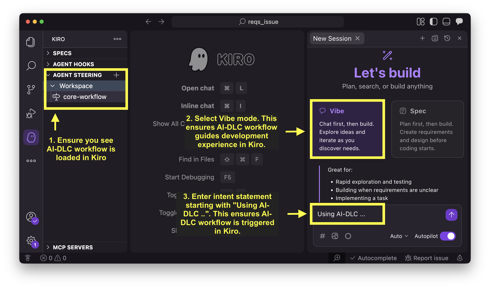
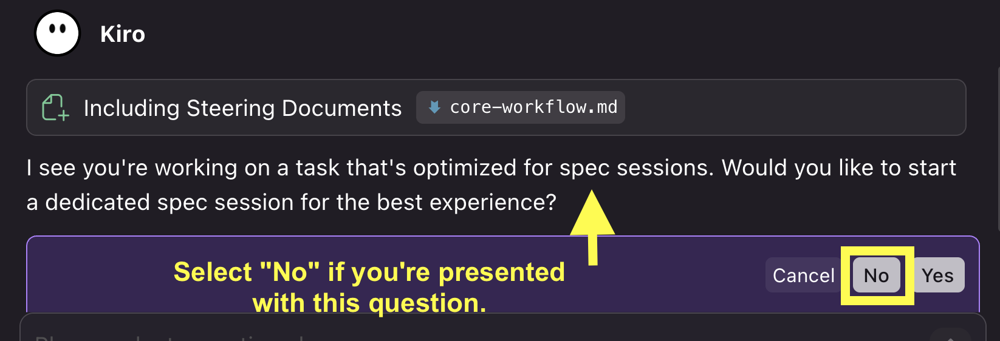
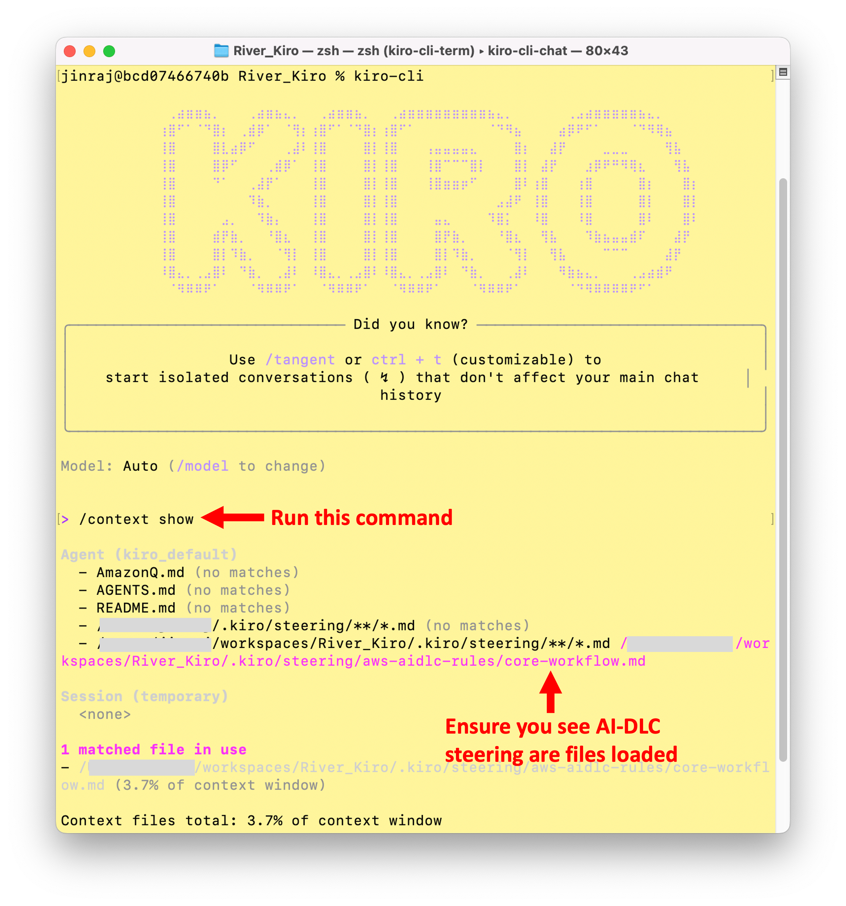
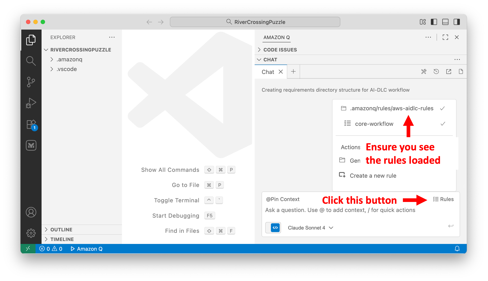
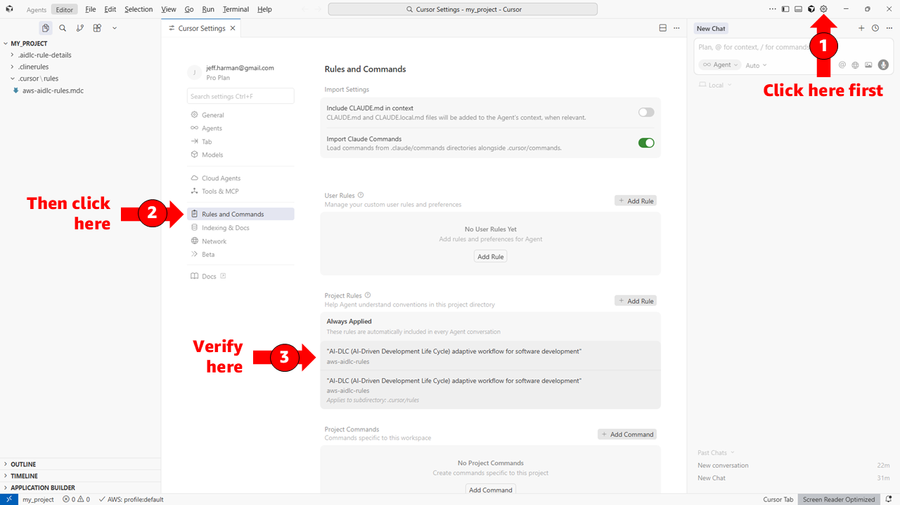
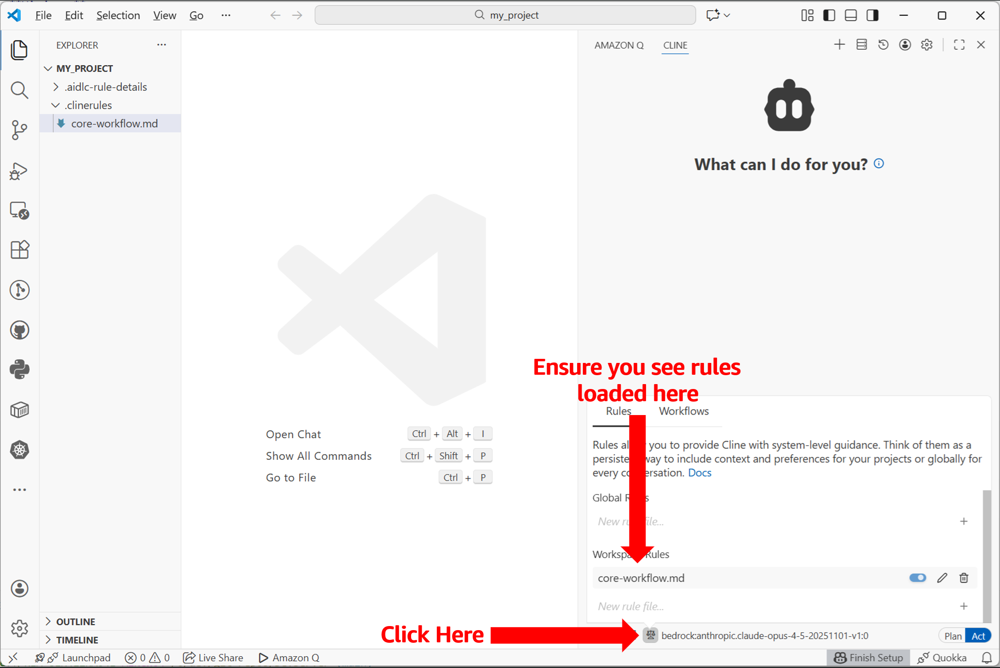

[← Voltar ao README](../README.pt-br.md)

# Fluxos de Trabalho AI-DLC (AI-DLC Workflows)

**Author:** Raja SP, AWS Labs <br>
**Source:** https://github.com/awslabs/aidlc-workflows <br>
**Adaptation:** Ricardo de Luna Galdino, EngSoft Learn<br>
**Download:** [ai-dlc_aws-setup.pt-br.pdf](pdf/ai-dlc_aws-setup.pt-br.pdf)


> [!IMPORTANT]
> A IA generativa pode cometer erros. Você deve considerar revisar todas as saídas e custos gerados pelo seu modelo de IA escolhido e assistente de codificação (agentic coding assistant). Veja a [Política de IA Responsável da AWS](https://aws.amazon.com/ai/responsible-ai/policy/).

<!-- TODO: Replace this Amplify URL with a permanent/stable URL when available -->
O AI-DLC é um fluxo de trabalho inteligente de desenvolvimento de software que se adapta às suas necessidades, mantém padrões de qualidade e mantém você no controle do processo. Para saber mais sobre a Metodologia AI-DLC, leia este [blog](https://aws.amazon.com/blogs/devops/ai-driven-development-life-cycle/) e o [Documento de Definição do Método (Method Definition Paper)](https://prod.d13rzhkk8cj2z0.amplifyapp.com/) referenciado nele.

## Índice (Table of Contents)
- [Comum (Common)](#comum-common)
- [Configuração Específica da Plataforma (Platform-Specific Setup)](#configuração-específica-da-plataforma-platform-specific-setup)
- [Uso (Usage)](#uso-usage)
- [Fluxo de Trabalho Adaptativo em Três Fases (Three-Phase Adaptive Workflow)](#fluxo-de-trabalho-adaptativo-em-três-fases-three-phase-adaptive-workflow)
- [Principais Recursos (Key Features)](#principais-recursos-key-features)
- [Extensões (Extensions)](#extensões-extensions)
- [Princípios (Tenets)](#princípios-tenets)
- [Pré-requisitos (Prerequisites)](#pré-requisitos-prerequisites)
- [Solução de Problemas (Troubleshooting)](#solução-de-problemas-troubleshooting)
- [Recomendações de Controle de Versão (Version Control Recommendations)](#recomendações-de-controle-de-versão-version-control-recommendations)
- [Recursos Adicionais (Additional Resources)](#recursos-adicionais-additional-resources)
- [Referência de aidlc-docs/ Gerados (Generated aidlc-docs/ Reference)](#referência-de-aidlc-docs-gerados-generated-aidlc-docs-reference)
- [Experimental: Configuração Assistida por IA (Experimental: AI-Assisted Setup)](#experimental-configuração-assistida-por-ia-experimental-ai-assisted-setup)
- [Contribuição (Contributing)](#contribuição-contributing)
- [Licença (License)](#licença-license)

---

## Comum (Common)
1. Faça o download do arquivo zip da versão mais recente chamado `ai-dlc-rules-v<release-number>.zip` na [página de Releases](https://github.com/awslabs/aidlc-workflows/releases/latest) para uma pasta **fora** do diretório do seu projeto (por exemplo, `~/Downloads`).
2. Extraia o zip. Ele contém uma pasta `aidlc-rules/` com dois subdiretórios:
   - `aws-aidlc-rules/` — as regras principais do fluxo de trabalho AI-DLC
   - `aws-aidlc-rule-details/` — regras detalhadas referenciadas condicionalmente pelas regras principais
3. Siga as instruções de configuração para o seu agente de codificação e plataforma abaixo.

---

## Configuração Específica da Plataforma (Platform-Specific Setup)
- [Kiro](#kiro)
- [Plugin/Extensão Amazon Q Developer IDE](#amazon-q-developer-ide-pluginextension)
- [Cursor IDE](#cursor-ide)
- [Cline](#cline)
- [Claude Code](#claude-code)
- [GitHub Copilot](#github-copilot)
- [OpenAI Codex](#openai-codex)
- [Outros Agentes (Other Agents)](#outros-agentes-other-agents)

---

### Kiro
O AI-DLC usa [Kiro Steering Files](https://kiro.dev/docs/cli/steering/) no espaço de trabalho (workspace) do seu projeto.  

Os comandos abaixo assumem que você extraiu o zip na sua pasta `Downloads`. Se você usou um local diferente, substitua `Downloads` pelo caminho real da sua pasta.

No macOS/Linux:

```bash
mkdir -p .kiro/steering
cp -R ~/Downloads/aidlc-rules/aws-aidlc-rules .kiro/steering/
cp -R ~/Downloads/aidlc-rules/aws-aidlc-rule-details .kiro/
```

No Windows (PowerShell):

```powershell
New-Item -ItemType Directory -Force -Path ".kiro\steering"
Copy-Item -Recurse "$env:USERPROFILE\Downloads\aidlc-rules\aws-aidlc-rules" ".kiro\steering\"
Copy-Item -Recurse "$env:USERPROFILE\Downloads\aidlc-rules\aws-aidlc-rule-details" ".kiro\"
```

No Windows (CMD):

```cmd
mkdir .kiro\steering
xcopy %USERPROFILE%\Downloads\aidlc-rules\aws-aidlc-rules .kiro\steering\aws-aidlc-rules\ /E /I
xcopy %USERPROFILE%\Downloads\aidlc-rules\aws-aidlc-rule-details .kiro\aws-aidlc-rule-details\ /E /I
```

Seu projeto deve ficar assim:

```text
<project-root>/
    ├── .kiro/
    │     ├── steering/
    │     │      ├── aws-aidlc-rules/
    │     ├── aws-aidlc-rule-details/
```

Para verificar se as regras foram carregadas:

#### Verificar na IDE do Kiro

Abra o painel de *steering files* e confirme que você vê uma entrada para `core-workflow` em `Workspace`, como mostrado na captura de tela abaixo.

<p align="center">
  
</p>

Nós usamos o Kiro IDE no modo Vibe (Vibe mode) para executar o fluxo de trabalho AI-DLC. Isso garante que o fluxo de trabalho AI-DLC oriente o desenvolvimento no Kiro. Às vezes, o Kiro pode sugerir que você mude para o modo de especificação (spec mode). Selecione `No` (Não) para esses prompts e continue no modo Vibe.

<p align="center">
  
</p>

#### Verificar no Kiro CLI

Execute `kiro-cli`, depois `/context show` e confirme as entradas para `.kiro/steering/aws-aidlc-rules`.

<p align="center">
  
</p>

---

### Plugin/Extensão Amazon Q Developer IDE
O AI-DLC usa [Amazon Q Rules](https://docs.aws.amazon.com/amazonq/latest/qdeveloper-ug/context-project-rules.html) no espaço de trabalho do seu projeto.

Os comandos abaixo assumem que você extraiu o zip na sua pasta `Downloads`. Se você usou um local diferente, substitua `Downloads` pelo caminho real da sua pasta.

No macOS/Linux:

```bash
mkdir -p .amazonq/rules
cp -R ~/Downloads/aidlc-rules/aws-aidlc-rules .amazonq/rules/
cp -R ~/Downloads/aidlc-rules/aws-aidlc-rule-details .amazonq/
```

No Windows (PowerShell):

```powershell
New-Item -ItemType Directory -Force -Path ".amazonq\rules"
Copy-Item -Recurse "$env:USERPROFILE\Downloads\aidlc-rules\aws-aidlc-rules" ".amazonq\rules\"
Copy-Item -Recurse "$env:USERPROFILE\Downloads\aidlc-rules\aws-aidlc-rule-details" ".amazonq\"
```

No Windows (CMD):

```cmd
mkdir .amazonq\rules
xcopy %USERPROFILE%\Downloads\aidlc-rules\aws-aidlc-rules .amazonq\rules\aws-aidlc-rules\ /E /I
xcopy %USERPROFILE%\Downloads\aidlc-rules\aws-aidlc-rule-details .amazonq\aws-aidlc-rule-details\ /E /I
```

Seu projeto deve ficar assim:

```text
<project-root>/
    ├── .amazonq/
    │     ├── rules/
    │     │     ├── aws-aidlc-rules/
    │     ├── aws-aidlc-rule-details/
```

Para verificar se as regras foram carregadas:

1. Na janela do Amazon Q Chat, clique no botão `Rules` no canto inferior direito.
2. Confirme que você vê entradas para `.amazonq/rules/aws-aidlc-rules`.

<p align="center">
  
</p>

---

### Cursor IDE
O AI-DLC usa [Cursor Rules](https://cursor.com/docs/context/rules) para implementar seu fluxo de trabalho inteligente.

Os comandos abaixo assumem que você extraiu o zip na sua pasta `Downloads`. Se você usou um local diferente, substitua `Downloads` pelo caminho real da sua pasta.

#### Opção 1: Regras do Projeto (Recomendado)

**Unix/Linux/macOS:**

```bash
mkdir -p .cursor/rules

cat > .cursor/rules/ai-dlc-workflow.mdc << 'EOF'
---
description: "Fluxo de trabalho adaptativo AI-DLC (AI-Driven Development Life Cycle) para desenvolvimento de software"
alwaysApply: true
---

EOF
cat ~/Downloads/aidlc-rules/aws-aidlc-rules/core-workflow.md >> .cursor/rules/ai-dlc-workflow.mdc

mkdir -p .aidlc-rule-details
cp -R ~/Downloads/aidlc-rules/aws-aidlc-rule-details/* .aidlc-rule-details/
```

**Windows PowerShell:**

```powershell
New-Item -ItemType Directory -Force -Path ".cursor\rules"

$frontmatter = @"
---
description: "Fluxo de trabalho adaptativo AI-DLC (AI-Driven Development Life Cycle) para desenvolvimento de software"
alwaysApply: true
---

"@
$frontmatter | Out-File -FilePath ".cursor\rules\ai-dlc-workflow.mdc" -Encoding utf8

Get-Content "$env:USERPROFILE\Downloads\aidlc-rules\aws-aidlc-rules\core-workflow.md" | Add-Content ".cursor\rules\ai-dlc-workflow.mdc"

New-Item -ItemType Directory -Force -Path ".aidlc-rule-details"
Copy-Item "$env:USERPROFILE\Downloads\aidlc-rules\aws-aidlc-rule-details\*" ".aidlc-rule-details\" -Recurse
```

**Windows CMD:**

```cmd
mkdir .cursor\rules

(
echo ---
echo description: "Fluxo de trabalho adaptativo AI-DLC (AI-Driven Development Life Cycle) para desenvolvimento de software"
echo alwaysApply: true
echo ---
echo.
) > .cursor\rules\ai-dlc-workflow.mdc

type "%USERPROFILE%\Downloads\aidlc-rules\aws-aidlc-rules\core-workflow.md" >> .cursor\rules\ai-dlc-workflow.mdc

mkdir .aidlc-rule-details
xcopy "%USERPROFILE%\Downloads\aidlc-rules\aws-aidlc-rule-details" ".aidlc-rule-details\" /E /I
```

#### Opção 2: AGENTS.md (Alternativa Simples)

**Unix/Linux/macOS:**

```bash
cp ~/Downloads/aidlc-rules/aws-aidlc-rules/core-workflow.md ./AGENTS.md
mkdir -p .aidlc-rule-details
cp -R ~/Downloads/aidlc-rules/aws-aidlc-rule-details/* .aidlc-rule-details/
```

**Windows PowerShell:**

```powershell
Copy-Item "$env:USERPROFILE\Downloads\aidlc-rules\aws-aidlc-rules\core-workflow.md" ".\AGENTS.md"
New-Item -ItemType Directory -Force -Path ".aidlc-rule-details"
Copy-Item "$env:USERPROFILE\Downloads\aidlc-rules\aws-aidlc-rule-details\*" ".aidlc-rule-details\" -Recurse
```

**Windows CMD:**

```cmd
copy "%USERPROFILE%\Downloads\aidlc-rules\aws-aidlc-rules\core-workflow.md" ".\AGENTS.md"
mkdir .aidlc-rule-details
xcopy "%USERPROFILE%\Downloads\aidlc-rules\aws-aidlc-rule-details" ".aidlc-rule-details\" /E /I
```

**Verificar Configuração:**

1. Abra as **Cursor Settings (Configurações) → Rules, Commands (Regras, Comandos)**
2. Em **Project Rules (Regras do Projeto)**, você deve ver `ai-dlc-workflow` listado
3. Para `AGENTS.md`, ele será detectado e aplicado automaticamente

<p align="center">
  
</p>

**Estrutura do Diretório (Opção 1):**

```text
<my-project>/
├── .cursor/
│   └── rules/
│       └── ai-dlc-workflow.mdc
└── .aidlc-rule-details/
    ├── common/
    ├── inception/
    ├── construction/
    ├── extensions/
    └── operations/
```

---

### Cline
O AI-DLC usa Cline Rules para implementar seu fluxo de trabalho inteligente.

Os comandos abaixo assumem que você extraiu o zip na sua pasta `Downloads`. Se você usou um local diferente, substitua `Downloads` pelo caminho real da sua pasta.

#### Opção 1: Diretório .clinerules (Recomendado)

**Unix/Linux/macOS:**

```bash
mkdir -p .clinerules
cp ~/Downloads/aidlc-rules/aws-aidlc-rules/core-workflow.md .clinerules/
mkdir -p .aidlc-rule-details
cp -R ~/Downloads/aidlc-rules/aws-aidlc-rule-details/* .aidlc-rule-details/
```

**Windows PowerShell:**

```powershell
New-Item -ItemType Directory -Force -Path ".clinerules"
Copy-Item "$env:USERPROFILE\Downloads\aidlc-rules\aws-aidlc-rules\core-workflow.md" ".clinerules\"
New-Item -ItemType Directory -Force -Path ".aidlc-rule-details"
Copy-Item "$env:USERPROFILE\Downloads\aidlc-rules\aws-aidlc-rule-details\*" ".aidlc-rule-details\" -Recurse
```

**Windows CMD:**

```cmd
mkdir .clinerules
copy "%USERPROFILE%\Downloads\aidlc-rules\aws-aidlc-rules\core-workflow.md" ".clinerules\"
mkdir .aidlc-rule-details
xcopy "%USERPROFILE%\Downloads\aidlc-rules\aws-aidlc-rule-details" ".aidlc-rule-details\" /E /I
```

#### Opção 2: AGENTS.md (Alternativa)

**Unix/Linux/macOS:**

```bash
cp ~/Downloads/aidlc-rules/aws-aidlc-rules/core-workflow.md ./AGENTS.md
mkdir -p .aidlc-rule-details
cp -R ~/Downloads/aidlc-rules/aws-aidlc-rule-details/* .aidlc-rule-details/
```

**Windows PowerShell:**

```powershell
Copy-Item "$env:USERPROFILE\Downloads\aidlc-rules\aws-aidlc-rules\core-workflow.md" ".\AGENTS.md"
New-Item -ItemType Directory -Force -Path ".aidlc-rule-details"
Copy-Item "$env:USERPROFILE\Downloads\aidlc-rules\aws-aidlc-rule-details\*" ".aidlc-rule-details\" -Recurse
```

**Windows CMD:**

```cmd
copy "%USERPROFILE%\Downloads\aidlc-rules\aws-aidlc-rules\core-workflow.md" ".\AGENTS.md"
mkdir .aidlc-rule-details
xcopy "%USERPROFILE%\Downloads\aidlc-rules\aws-aidlc-rule-details" ".aidlc-rule-details\" /E /I
```

**Verificar Configuração:**

1. Na interface de chat do Cline, procure o botão *Rules* (Regras) abaixo do campo de entrada de chat
2. Verifique se `core-workflow.md` está listado e ativo
3. Você pode ativar/desativar o arquivo de regras conforme necessário

<p align="center">
  
</p>

**Estrutura do Diretório (Opção 1):**

```text
<my-project>/
├── .clinerules/
│   └── core-workflow.md
└── .aidlc-rule-details/
    ├── common/
    ├── inception/
    ├── construction/
    ├── extensions/
    └── operations/
```

---

### Claude Code
O AI-DLC usa o arquivo de memória de projeto do Claude Code (`CLAUDE.md`) para implementar seu fluxo de trabalho inteligente.

Os comandos abaixo assumem que você extraiu o zip na sua pasta `Downloads`. Se você usou um local diferente, substitua `Downloads` pelo caminho real da sua pasta.

#### Opção 1: Raiz do Projeto (Recomendado)

**Unix/Linux/macOS:**

```bash
cp ~/Downloads/aidlc-rules/aws-aidlc-rules/core-workflow.md ./CLAUDE.md
mkdir -p .aidlc-rule-details
cp -R ~/Downloads/aidlc-rules/aws-aidlc-rule-details/* .aidlc-rule-details/
```

**Windows PowerShell:**

```powershell
Copy-Item "$env:USERPROFILE\Downloads\aidlc-rules\aws-aidlc-rules\core-workflow.md" ".\CLAUDE.md"
New-Item -ItemType Directory -Force -Path ".aidlc-rule-details"
Copy-Item "$env:USERPROFILE\Downloads\aidlc-rules\aws-aidlc-rule-details\*" ".aidlc-rule-details\" -Recurse
```

**Windows CMD:**

```cmd
copy "%USERPROFILE%\Downloads\aidlc-rules\aws-aidlc-rules\core-workflow.md" ".\CLAUDE.md"
mkdir .aidlc-rule-details
xcopy "%USERPROFILE%\Downloads\aidlc-rules\aws-aidlc-rule-details" ".aidlc-rule-details\" /E /I
```

#### Opção 2: Diretório .claude

**Unix/Linux/macOS:**

```bash
mkdir -p .claude
cp ~/Downloads/aidlc-rules/aws-aidlc-rules/core-workflow.md .claude/CLAUDE.md
mkdir -p .aidlc-rule-details
cp -R ~/Downloads/aidlc-rules/aws-aidlc-rule-details/* .aidlc-rule-details/
```

**Windows PowerShell:**

```powershell
New-Item -ItemType Directory -Force -Path ".claude"
Copy-Item "$env:USERPROFILE\Downloads\aidlc-rules\aws-aidlc-rules\core-workflow.md" ".claude\CLAUDE.md"
New-Item -ItemType Directory -Force -Path ".aidlc-rule-details"
Copy-Item "$env:USERPROFILE\Downloads\aidlc-rules\aws-aidlc-rule-details\*" ".aidlc-rule-details\" -Recurse
```

**Windows CMD:**

```cmd
mkdir .claude
copy "%USERPROFILE%\Downloads\aidlc-rules\aws-aidlc-rules\core-workflow.md" ".claude\CLAUDE.md"
mkdir .aidlc-rule-details
xcopy "%USERPROFILE%\Downloads\aidlc-rules\aws-aidlc-rule-details" ".aidlc-rule-details\" /E /I
```

**Verificar Configuração:**

1. Inicie o Claude Code no diretório do seu projeto (CLI: `claude` ou extensão VS Code)
2. Use o comando `/config` para ver a configuração atual
3. Pergunte ao Claude: "Quais instruções estão ativas neste projeto?"

**Estrutura do Diretório (Opção 1):**

```text
<my-project>/
├── CLAUDE.md
└── .aidlc-rule-details/
    ├── common/
    ├── inception/
    ├── construction/
    ├── extensions/
    └── operations/
```

---

### GitHub Copilot
O AI-DLC usa [instruções personalizadas do GitHub Copilot (GitHub Copilot custom instructions)](https://code.visualstudio.com/docs/copilot/customization/custom-instructions) para implementar seu fluxo de trabalho inteligente. O arquivo `.github/copilot-instructions.md` é detectado automaticamente e aplicado a todas as solicitações de chat no espaço de trabalho.

Os comandos abaixo assumem que você extraiu o zip na sua pasta `Downloads`. Se você usou um local diferente, substitua `Downloads` pelo caminho real da sua pasta.

**Unix/Linux/macOS:**

```bash
mkdir -p .github
cp ~/Downloads/aidlc-rules/aws-aidlc-rules/core-workflow.md .github/copilot-instructions.md
mkdir -p .aidlc-rule-details
cp -R ~/Downloads/aidlc-rules/aws-aidlc-rule-details/* .aidlc-rule-details/
```

**Windows PowerShell:**

```powershell
New-Item -ItemType Directory -Force -Path ".github"
Copy-Item "$env:USERPROFILE\Downloads\aidlc-rules\aws-aidlc-rules\core-workflow.md" ".github\copilot-instructions.md"
New-Item -ItemType Directory -Force -Path ".aidlc-rule-details"
Copy-Item "$env:USERPROFILE\Downloads\aidlc-rules\aws-aidlc-rule-details\*" ".aidlc-rule-details\" -Recurse
```

**Windows CMD:**

```cmd
mkdir .github
copy "%USERPROFILE%\Downloads\aidlc-rules\aws-aidlc-rules\core-workflow.md" ".github\copilot-instructions.md"
mkdir .aidlc-rule-details
xcopy "%USERPROFILE%\Downloads\aidlc-rules\aws-aidlc-rule-details" ".aidlc-rule-details\" /E /I
```

**Verificar Configuração:**

1. Abra o VS Code com a pasta do seu projeto
2. Abra o painel do Copilot Chat (Cmd/Ctrl+Shift+I)
3. Selecione **Configure Chat (Configurar Chat)** (ícone de engrenagem) > **Chat Instructions (Instruções do Chat)** e verifique se `copilot-instructions` está listado
4. Alternativamente, digite `/instructions` na entrada de chat para ver as instruções ativas

**Estrutura do Diretório:**

```text
<my-project>/
├── .github/
│   └── copilot-instructions.md
└── .aidlc-rule-details/
    ├── common/
    ├── inception/
    ├── construction/
    ├── extensions/
    └── operations/
```

---

### OpenAI Codex
O AI-DLC suporta o OpenAI Codex como um agente de codificação, usando a convenção [Codex AGENTS.md](https://developers.openai.com/codex/guides/agents-md) para entregar seu fluxo de trabalho inteligente. O Codex descobre automaticamente e carrega o `AGENTS.md` a partir da raiz do seu projeto ao iniciar uma sessão.

Os comandos abaixo assumem que você extraiu o zip na sua pasta `Downloads`. Se você usou um local diferente, substitua `Downloads` pelo caminho real da sua pasta.

**Unix/Linux/macOS:**

```bash
cp ~/Downloads/aidlc-rules/aws-aidlc-rules/core-workflow.md ./AGENTS.md
mkdir -p .aidlc-rule-details
cp -R ~/Downloads/aidlc-rules/aws-aidlc-rule-details/* .aidlc-rule-details/
```

**Windows PowerShell:**

```powershell
Copy-Item "$env:USERPROFILE\Downloads\aidlc-rules\aws-aidlc-rules\core-workflow.md" ".\AGENTS.md"
New-Item -ItemType Directory -Force -Path ".aidlc-rule-details"
Copy-Item "$env:USERPROFILE\Downloads\aidlc-rules\aws-aidlc-rule-details\*" ".aidlc-rule-details\" -Recurse
```

**Windows CMD:**

```cmd
copy "%USERPROFILE%\Downloads\aidlc-rules\aws-aidlc-rules\core-workflow.md" ".\AGENTS.md"
mkdir .aidlc-rule-details
xcopy "%USERPROFILE%\Downloads\aidlc-rules\aws-aidlc-rule-details" ".aidlc-rule-details\" /E /I
```

**Verificar Configuração:**

1. Inicie uma sessão do Codex no diretório do seu projeto
2. Pergunte ao Codex: Para um projeto existente - "Using AIDLC analyze the project?" (Usando AI-DLC, analise o projeto?) ou Para um novo projeto - "Using Aidlc what workflow do you see" (Usando AI-DLC, qual fluxo de trabalho você vê?).
3. O Codex deve descrever o fluxo de trabalho de três fases do AI-DLC (Inception → Construction → Operations)

> [!NOTE]
> O arquivo `AGENTS.md` é projetado para caber no orçamento de instruções do Codex nas configurações padrão. Se você adicionar conteúdo substancial específico do projeto e o Codex informar que a documentação do projeto excede o limite de instruções, você pode aumentar o limite na configuração do Codex (por exemplo, ajustando `project_doc_max_bytes` no seu arquivo `config.toml`):
>
> ```toml
> project_doc_max_bytes = 65536  # Valor de exemplo; escolha um limite apropriado para o seu projeto
> ```

**Estrutura do Diretório:**

```text
<my-project>/
├── AGENTS.md
└── .aidlc-rule-details/
    ├── common/
    ├── inception/
    ├── construction/
    ├── extensions/
    └── operations/
```

---

### Outros Agentes (Other Agents)
O AI-DLC funciona com qualquer agente de codificação que suporte regras ou *steering files* em nível de projeto. A abordagem geral:

1. Coloque `aws-aidlc-rules/` no local onde seu agente lê regras de projeto (consulte a documentação do seu agente).
2. Coloque `aws-aidlc-rule-details/` no mesmo nível (como diretório irmão) para que as regras possam referenciá-lo.

Se o seu agente não possui uma convenção para arquivos de regras, coloque ambas as pastas na raiz do seu projeto e aponte o agente para `aws-aidlc-rules/` como o seu diretório de regras.

---

## Uso (Usage)
1. Inicie qualquer projeto de desenvolvimento de software declarando sua intenção com a frase **"Using AI-DLC, ..."** (Usando AI-DLC, ...) no chat
2. O fluxo de trabalho AI-DLC é ativado automaticamente e guia você a partir daí
3. Responda às perguntas estruturadas que o AI-DLC faz a você
4. Revise cuidadosamente todo plano gerado pela IA. Forneça sua supervisão e validação
5. Revise o plano de execução para ver quais etapas serão executadas
6. Revise cuidadosamente os artefatos e aprove cada fase para manter o controle
7. Todos os artefatos serão gerados no diretório `aidlc-docs/`

---

## Fluxo de Trabalho Adaptativo em Três Fases (Three-Phase Adaptive Workflow)
O AI-DLC segue uma abordagem estruturada em três fases que se adapta à complexidade do seu projeto:

### 🔵 FASE DE INICIAÇÃO (INCEPTION PHASE)
Determina **O QUE (WHAT)** construir e **POR QUE (WHY)**

- Análise e validação de requisitos
- Criação de histórias de usuários (quando aplicável)
- Design da Aplicação e criação de unidades de trabalho para desenvolvimento paralelo
- Avaliação de risco e da complexidade

### 🟢 FASE DE CONSTRUÇÃO (CONSTRUCTION PHASE)
Determina **COMO (HOW)** construir

- Design detalhado de componentes
- Geração de código e implementação
- Configuração de build e estratégias de teste
- Garantia de qualidade e validação

### 🟡 FASE DE OPERAÇÕES (OPERATIONS PHASE)
Implantação e monitoramento (futuro)

- Automação de implantação e infraestrutura
- Configuração de monitoramento e observabilidade
- Validação de prontidão para produção

---

## Principais Recursos (Key Features)
| Recurso (Feature)         | Descrição                                                                                                                                           |
| ------------------------- | --------------------------------------------------------------------------------------------------------------------------------------------------- |
| **Inteligência Adaptativa** | Executa apenas as etapas que agregam valor à sua solicitação específica                                                                             |
| **Consciência de Contexto** | Analisa a base de código existente e os requisitos de complexidade                                                                                  |
| **Baseado em Risco**      | Alterações complexas recebem tratamento abrangente, alterações simples mantêm-se eficientes                                                         |
| **Guiado por Perguntas**  | Perguntas estruturadas de múltipla escolha em arquivos, não no chat                                                                                 |
| **Sempre no Controle**    | Revise planos de execução e aprove cada fase                                                                                                        |
| **Extensível**            | Adicione regras personalizadas (ex: segurança, conformidade e regras específicas da organização) sobre o fluxo de trabalho principal                |

---

## Extensões (Extensions)
O AI-DLC suporta um sistema de extensão que permite adicionar regras adicionais no fluxo de trabalho principal. Extensões são arquivos markdown organizados em `aws-aidlc-rule-details/extensions/` e agrupados por categoria (ex: `security/`, `testing/`).

### Como as Extensões Funcionam
Cada extensão consiste em dois arquivos no mesmo diretório:

- Um **arquivo de regras** (ex: `security-baseline.md`) contendo as regras da extensão.
- Um **arquivo de adesão (opt-in)** (ex: `security-baseline.opt-in.md`) contendo uma pergunta estruturada de múltipla escolha apresentada ao usuário durante a Análise de Requisitos.

No início do fluxo de trabalho, o AI-DLC analisa o diretório `extensions/` e carrega apenas arquivos `*.opt-in.md`. Durante a Análise de Requisitos, ele apresenta cada prompt de adesão ao usuário. Quando o usuário adere (opt-in), o arquivo de regras correspondente é carregado (nomeado removendo `.opt-in.md` e adicionando `.md`). Quando o usuário não adere (opt-out), o arquivo de regras nunca é carregado. Extensões sem um arquivo `*.opt-in.md` correspondente são sempre aplicadas.

Uma vez habilitadas, as regras de extensão são restrições bloqueantes — em cada etapa, o modelo verifica a conformidade antes de permitir que a etapa continue.

### Extensões Integradas
O diretório `extensions/` é fornecido com as seguintes extensões (novas podem ser adicionadas com o tempo):

```text
aws-aidlc-rule-details/
└── extensions/
    ├── security/                      # Categoria de extensão (Segurança)
    │   └── baseline/
    │       ├── security-baseline.md          # Regras de segurança base
    │       └── security-baseline.opt-in.md   # Prompt de adesão
    └── testing/                       # Categoria de extensão (Testes)
        └── property-based/
            ├── property-based-testing.md          # Regras de testes baseados em propriedades
            └── property-based-testing.opt-in.md   # Prompt de adesão
```

> [!IMPORTANT]
> As regras da extensão de segurança são fornecidas como referência para a construção de regras eficazes nos fluxos de trabalho AI-DLC. Cada organização deve construir, personalizar e testar rigorosamente suas próprias regras de segurança antes de aplicá-las em fluxos de produção.

### Adicionando Suas Próprias Extensões
Você pode expandir uma categoria existente ou criar uma totalmente nova.

1. Crie um diretório sob `extensions/` (ex: `security/compliance/` ou `performance/baseline/`).
2. Adicione um **arquivo de regras** (ex: `compliance.md`). Siga a mesma estrutura de `security-baseline.md`:
   - Defina cada regra como um título no formato `## Regra <PREFIXO-NN>: <Título>`, onde o prefixo é um identificador curto da categoria e NN é um número sequencial (ex: `COMPLIANCE-01`, `COMPLIANCE-02`). Esses IDs são referenciados em registros de auditoria e resumos de conformidade e devem ser únicos.
   - Inclua uma seção **Regra (Rule)** descrevendo o requisito.
   - Inclua uma seção **Verificação (Verification)** com as verificações que o modelo deve avaliar.
3. Adicione um **arquivo de adesão (opt-in)** correspondente com a nomenclatura `<nome>.opt-in.md` (ex: `compliance.opt-in.md`). Veja `security-baseline.opt-in.md` para o formato esperado. Omitir este arquivo significa que a extensão será sempre aplicada sem opção de recusa (opt-out) pelo usuário.
4. As regras são bloqueantes por padrão — se os critérios de verificação não forem atendidos, a etapa não pode prosseguir até que a descoberta seja resolvida.

---

## Princípios (Tenets)
Estes são os nossos princípios fundamentais para orientar nossa tomada de decisão.

- **Sem duplicação**. A fonte da verdade reside em um único lugar. Se adicionarmos suporte a novas ferramentas que exigem arquivos específicos, os geraremos a partir da fonte ao invés de manter cópias separadas.

- **Metodologia em primeiro lugar**. O AI-DLC é fundamentalmente uma metodologia, não uma ferramenta. Os usuários não deveriam precisar instalar nada para começar. No entanto, estamos abertos a criar ferramentas de conveniência (scripts, CLIs) no futuro, caso ajudem os usuários a adotar a metodologia.

- **Reprodutível**. As regras devem ser claras o suficiente para que modelos diferentes produzam resultados parecidos. Sabemos que os modelos se comportam de maneira diferente, mas a metodologia deve minimizar a variação através de orientações explícitas.

- **Agnóstico**. A metodologia funciona com qualquer IDE, agente ou modelo. Não nos atrelamos a ferramentas ou fornecedores específicos.

- **Humano no ciclo (Human in the loop)**. Decisões críticas exigem confirmação explícita do usuário. O agente propõe, o humano aprova.

---

## Pré-requisitos (Prerequisites)
Tenha instalada uma de nossas plataformas/ferramentas suportadas para Codificação Assistida por IA:

| Plataforma (Platform)         | Link de Instalação                                                                                                                                              |
| ----------------------------- | --------------------------------------------------------------------------------------------------------------------------------------------------------------- |
| Kiro                          | [Instalar](https://kiro.dev/)                                                                                                                                   |
| Kiro CLI                      | [Instalar](https://kiro.dev/cli/)                                                                                                                               |
| Amazon Q Developer IDE Plugin | [Instalar](https://docs.aws.amazon.com/amazonq/latest/qdeveloper-ug/q-in-IDE.html)                                                                              |
| Cursor IDE                    | [Instalar](https://cursor.com/)                                                                                                                                 |
| Extensão Cline VS Code        | [Instalar](https://marketplace.visualstudio.com/items?itemName=saoudrizwan.claude-dev)                                                                          |
| Claude Code CLI               | [Instalar](https://github.com/anthropics/claude-code)                                                                                                           |
| GitHub Copilot                | [Instalar](https://marketplace.visualstudio.com/items?itemName=GitHub.copilot) + [Chat](https://marketplace.visualstudio.com/items?itemName=GitHub.copilot-chat)|

---

### Problemas Gerais
| Problema                      | Solução                                                     |
| ----------------------------- | ----------------------------------------------------------- |
| Regras não carregam           | Verifique se o arquivo existe no local correto para sua plataforma |
| Problemas de codificação      | Certifique-se de que os arquivos estão em codificação UTF-8 |
| Regras não aplicadas na sessão| Inicie uma nova sessão de chat após alterar os arquivos     |
| Detalhes de regras não carregam| Verifique se `.aidlc-rule-details/` existe com seus subdiretórios |

### Problemas Específicos da Plataforma
#### Kiro

- Use `/context show` no Kiro CLI para verificar se as regras foram carregadas
- Verifique a estrutura do diretório `.kiro/steering/`
- Nota: O Kiro usa `aws-aidlc-rule-details` (e não `.aidlc-rule-details/`) no diretório `.kiro/`

#### Amazon Q Developer

- Verifique a estrutura do diretório `.amazonq/rules/`
- Verifique se as regras estão listadas no painel de Regras (Rules) do Amazon Q Chat
- Nota: O Amazon Q usa `aws-aidlc-rule-details` (e não `.aidlc-rule-details/`) no diretório `.amazonq/`

#### Cursor

- Para "Apply Intelligently" (Aplicar Inteligentemente), certifique-se de que uma descrição está definida no *frontmatter*
- Acesse **Cursor Settings → Rules** para garantir que a regra está habilitada
- Se a regra for muito grande (>500 linhas), divida em várias regras focadas

#### Cline

- Verifique a janela flutuante (popover) de Regras (Rules) sob o campo de entrada de chat
- Ative ou desative arquivos de regras conforme necessário usando a interface da janela flutuante

#### Claude Code

- Use o comando `/config` para ver a configuração atual
- Pergunte: "Quais instruções estão ativas neste projeto?"

#### GitHub Copilot

- Selecione **Configure Chat (Configurar Chat)** (ícone de engrenagem) > **Chat Instructions (Instruções do Chat)** para verificar se as instruções estão carregadas
- Digite `/instructions` na entrada de chat para ver os arquivos de instrução ativos
- Verifique se `.github/copilot-instructions.md` existe na raiz da sua área de trabalho

### Problemas com Caminhos de Arquivo no Windows
- Use barras normais `/` em caminhos de arquivo dentro de arquivos markdown
- Caminhos no Windows com barras invertidas `\` podem não funcionar corretamente

---

## Recomendações de Controle de Versão (Version Control Recommendations)
**Fazer commit no repositório:**

```gitignore
# Estes devem ser controlados por versão (version controlled)
CLAUDE.md
AGENTS.md
.amazonq/rules/
.amazonq/aws-aidlc-rule-details/
.kiro/steering/
.kiro/aws-aidlc-rule-details/
.cursor/rules/
.clinerules/
.github/copilot-instructions.md
.aidlc-rule-details/
```

**Opcional - Adicionar ao `.gitignore` (se necessário):**

```gitignore
# Configurações apenas locais
.claude/settings.local.json
```

---

## Referência de aidlc-docs/ Gerados (Generated aidlc-docs/ Reference)
Para a referência completa de todos os artefatos de documentação gerados pelo fluxo de trabalho AI-DLC, veja [docs/GENERATED_DOCS_REFERENCE.md](https://github.com/awslabs/aidlc-workflows/blob/main/docs/GENERATED_DOCS_REFERENCE.md).

---

## Experimental: Configuração Assistida por IA (Experimental: AI-Assisted Setup)
> Ao invés de copiar os arquivos manualmente, deixe que seu agente de IA faça a configuração. Este é um fluxo de trabalho experimental — atualmente validado com Kiro, Claude Code, Cursor e Antigravity.
>
> **Nota:** Esta abordagem exige que o seu agente tenha acesso ao shell/terminal (ex: Kiro, Claude Code, Cline). Para agentes sem acesso ao shell, siga a configuração [Comum (Common)](#comum-common) acima.

Cole este prompt no seu agente de IA:

```text
Set up AI-DLC in this project by doing the following:

1. Download the latest AI-DLC release:
   - Use the GitHub API to find the latest release asset URL:
     curl -sL https://api.github.com/repos/awslabs/aidlc-workflows/releases/latest \
       | grep -o '"browser_download_url": *"[^"]*"' \
       | head -1 \
       | cut -d'"' -f4
   - Download the zip from that URL to /tmp/aidlc-rules.zip
   - Extract it: unzip -o /tmp/aidlc-rules.zip -d /tmp/aidlc-release
   - Copy the aidlc-rules/ folder from the extracted contents into .aidlc at the project root
   - Clean up: rm -rf /tmp/aidlc-rules.zip /tmp/aidlc-release

2. Create the appropriate rules/steering file for your IDE using the options below.
   Pick the one that matches the agent you are running in:

   - Kiro IDE or Kiro CLI     → create `.kiro/steering/ai-dlc.md`
   - Amazon Q Developer       → create `.amazonq/rules/ai-dlc.md`
   - Antigravity              → create `.agent/rules/ai-dlc.md`
   - Cursor                   → create `.cursor/rules/ai-dlc.mdc` with frontmatter:
                                  ---
                                  description: "AI-DLC workflow"
                                  alwaysApply: true
                                  ---
   - Cline                    → create `.clinerules/ai-dlc.md`
   - Claude Code              → create `CLAUDE.md`
   - GitHub Copilot           → create `.github/copilot-instructions.md`
   - Any other agent          → create `AGENTS.md`

3. The file content should be:
   When the user invokes AI-DLC, read and follow
   `.aidlc/aidlc-rules/aws-aidlc-rules/core-workflow.md` to start the workflow.

4. Add `.aidlc` to `.gitignore` unless I explicitly ask you not to.

5. Confirm what file you created and that `.aidlc` is gitignored.
```

O agente baixará o lançamento mais recente, criará o arquivo de configuração correto para a sua IDE e adicionará o diretório `.aidlc` ao gitignore automaticamente.

**Atualizando o AI-DLC** — Execute o prompt acima novamente. O agente fará o download do lançamento mais recente e substituirá a pasta `.aidlc/` existente.

---

## Recursos Adicionais (Additional Resources)
<!-- TODO: Replace this Amplify URL with a permanent/stable URL when available -->
| Recurso (Resource)                                  | Link                                                                                                                          |
| --------------------------------------------------- | ----------------------------------------------------------------------------------------------------------------------------- |
| AI-DLC Method Definition Paper                      | [Paper](https://prod.d13rzhkk8cj2z0.amplifyapp.com/)                                                                          |
| AI-DLC Methodology Blog                             | [AWS Blog](https://aws.amazon.com/blogs/devops/ai-driven-development-life-cycle/)                                             |
| AI-DLC Open-source Launch Blog                      | [AWS Blog](https://aws.amazon.com/blogs/devops/open-sourcing-adaptive-workflows-for-ai-driven-development-life-cycle-ai-dlc/) |
| AI-DLC Example Walkthrough Blog                     | [AWS Blog](https://aws.amazon.com/blogs/devops/building-with-ai-dlc-using-amazon-q-developer/)                                |
| Amazon Q Developer Documentation                    | [Docs](https://docs.aws.amazon.com/amazonq/latest/qdeveloper-ug/q-in-IDE.html)                                                |
| Kiro CLI Documentation                              | [Docs](https://kiro.dev/docs/cli/steering/)                                                                                   |
| Cursor Rules Documentation                          | [Docs](https://cursor.com/docs/context/rules)                                                                                 |
| Claude Code Documentation                           | [GitHub](https://github.com/anthropics/claude-code)                                                                           |
| GitHub Copilot Documentation                        | [Docs](https://docs.github.com/en/copilot)                                                                                    |
| Trabalhando com AI-DLC (Working with AI-DLC)        | [docs/WORKING-WITH-AIDLC.md](https://github.com/awslabs/aidlc-workflows/blob/main/docs/WORKING-WITH-AIDLC.md)                                                                      |
| Diretrizes de Contribuição (Contributing Guidelines)| [CONTRIBUTING.md](https://github.com/awslabs/aidlc-workflows/blob/main/CONTRIBUTING.md)                                                                                            |
| Código de Conduta (Code of Conduct)                 | [CODE_OF_CONDUCT.md](https://github.com/awslabs/aidlc-workflows/blob/main/CODE_OF_CONDUCT.md)                                                                                      |

---

## Contribuição (Contributing)
Veja [CONTRIBUTING](https://github.com/awslabs/aidlc-workflows/blob/main/CONTRIBUTING.md#security-issue-notifications) para obter mais informações.

## Licença (License)
Esta biblioteca está licenciada sob a Licença MIT-0. Veja o arquivo [LICENSE](https://github.com/awslabs/aidlc-workflows/blob/main/LICENSE).
