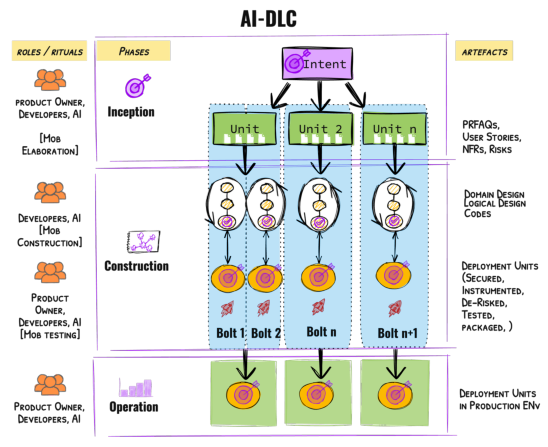
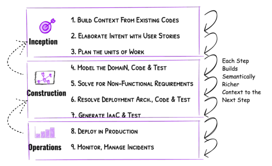
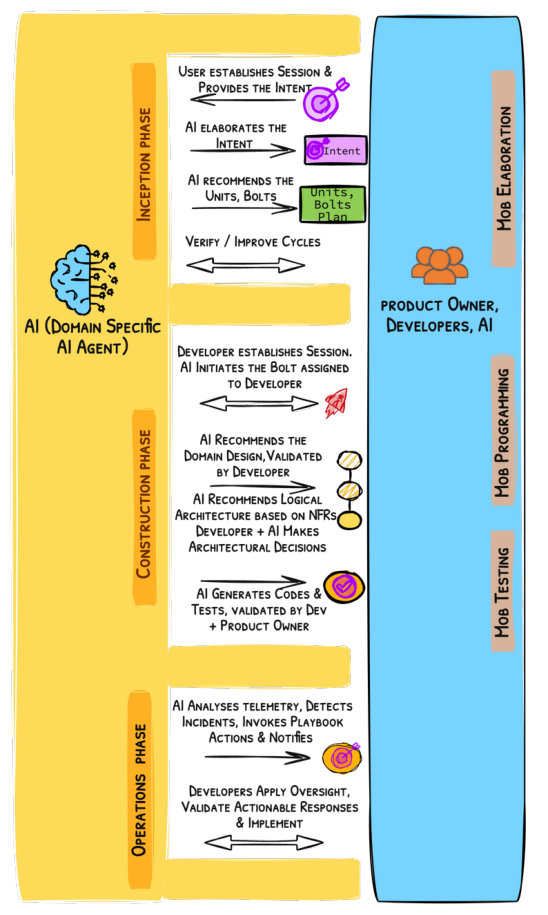

[← Voltar ao README](../README.pt-br.md)

# Definição do Método AI-Driven Development Lifecycle (AI-DLC)

**Author:** Raja SP, Amazon Web Services  
**Source:** https://prod.d13rzhkk8cj2z0.amplifyapp.com/  
**Setup:** https://github.com/awslabs/aidlc-workflows  
**Adaptation:** Ricardo de Luna Galdino, EngSoft Learn 
**Download:** [ai-dlc_aws-white-paper_raja-sp.pt-br.pdf](pdf/ai-dlc_aws-white-paper_raja-sp.pt-br.pdf)

## I. CONTEXTO (CONTEXT)

A engenharia de software sempre buscou uma forma de deixar os desenvolvedores focarem no que realmente importa: resolver problemas complexos. Para isso, ao longo do tempo, foram criadas abstrações que eliminaram tarefas repetitivas e de baixo nível — do código de máquina às linguagens de alto nível, passando por APIs e bibliotecas. Cada avanço aumentou significativamente a produtividade dos times.

Agora, com a chegada dos Grandes Modelos de Linguagem (LLMs), o desenvolvimento de software passa por uma nova revolução. É possível usar linguagem natural para gerar código, detectar bugs e criar testes automaticamente. Estamos na era da **IA Assistida**, onde a IA ajuda em tarefas específicas do dia a dia do desenvolvedor.

Mas a IA está evoluindo além disso. Ela já começa a participar de etapas como elaboração de requisitos, planejamento, divisão de tarefas, design e colaboração em tempo real. Isso nos leva à era da **IA Dirigida (AI-Driven)**, onde a IA passa a coordenar ativamente o processo de desenvolvimento.

O problema é que os métodos atuais de desenvolvimento de software — como Scrum e outros modelos ágeis — foram criados para times humanos trabalhando em ciclos longos. Eles não aproveitam bem a velocidade e a flexibilidade da IA. Tentar encaixar a IA nesses métodos antigos é como colocar um motor moderno numa carruagem: você limita o potencial e mantém as ineficiências do passado.

Para aproveitar de verdade o poder da IA, precisamos repensar o processo de desenvolvimento do zero — com a IA como parte central, e não como um acessório.

Este artigo apresenta o **AI-Driven Development Lifecycle (AI-DLC)**: uma metodologia nova, pensada desde o início para funcionar com IA, e que estabelece as bases para o próximo salto na engenharia de software.

## II. PRINCÍPIOS FUNDAMENTAIS (KEY PRINCIPLES)

Os princípios a seguir formam a base do AI-DLC. Eles guiam a definição de suas fases, papéis, artefatos e rituais. Entender esses princípios é essencial para compreender as decisões de design do método.

### 1. REIMAGINAR, NÃO ADAPTAR (REIMAGINE RATHER THAN RETROFIT)

Em vez de pegar métodos como Scrum ou SDLC e tentar encaixar a IA neles, o AI-DLC foi criado do zero com a IA em mente.

Os métodos tradicionais foram feitos para ciclos longos — de semanas ou meses. Por isso, criaram rituais como daily standups e retrospectivas. Com a IA, os ciclos passam a ser medidos em horas ou dias. Isso torna muitos desses rituais desnecessários.

Algumas perguntas surgem naturalmente: faz sentido estimar esforço com story points se a IA reduz a diferença entre tarefas fáceis e difíceis? A métrica de velocity ainda é relevante, ou deveria ser substituída por Valor de Negócio?

Além disso, a IA já consegue automatizar atividades como planejamento, divisão de tarefas, análise de requisitos e modelagem de domínio. Isso encurta bastante o caminho entre uma ideia e o código final.

Por tudo isso, o AI-DLC não é uma versão "atualizada" do Scrum — é uma reinvenção completa, baseada nos primeiros princípios. Precisamos de automóveis, não de carruagens mais rápidas.

### 2. INVERTER A DIREÇÃO DA CONVERSA (REVERSE THE CONVERSATION DIRECTION)

No modelo tradicional, o desenvolvedor inicia a conversa com a IA para completar uma tarefa. No AI-DLC, isso se inverte: **a IA é quem inicia e conduz a conversa**.

A IA recebe uma intenção de alto nível — como "implementar uma nova funcionalidade de negócio" — e a divide em tarefas menores, gera recomendações e apresenta as opções com seus respectivos trade-offs. O humano age como aprovador: valida, escolece e confirma as decisões nos momentos críticos.

Essa inversão permite que o desenvolvedor foque em decisões de alto valor, enquanto a IA cuida do planejamento, da decomposição e da automação.

Uma analogia simples: pense no Google Maps. Você define o destino (a intenção), e o sistema traça o caminho passo a passo. Você acompanha e intervém quando necessário.

### 3. INTEGRAR TÉCNICAS DE DESIGN AO NÚCLEO DO MÉTODO (INTEGRATION OF DESIGN TECHNIQUES INTO THE CORE)

Frameworks ágeis como Scrum e Kanban não prescrevem técnicas de design — cada time escolhe as suas. Isso criou lacunas que resultaram em software de baixa qualidade. Só nos EUA, os problemas de qualidade de software custaram aproximadamente **US$ 2,41 trilhões em 2022**.

O AI-DLC resolve isso integrando as técnicas de design diretamente ao método, sem deixá-las como opcionais. Haverá variações do AI-DLC para times que usam **Domain-Driven Design (DDD)**, **Test-Driven Development (TDD)** e **Behavior-Driven Development (BDD)**.

Este artigo descreve a variação com DDD, onde os sistemas são divididos em **bounded contexts** — partes independentes e bem dimensionadas que podem ser construídas em paralelo. A IA aplica essas técnicas automaticamente durante o planejamento e a divisão de tarefas; o desenvolvedor só precisa validar e ajustar.

Essa integração é fundamental para permitir ciclos de iteração em horas ou dias, eliminando o trabalho manual pesado e mantendo a qualidade do software — o lema é: **"Construir Sistemas Melhores e Mais Rápido"**.

### 4. ALINHAR COM AS CAPACIDADES REAIS DA IA (ALIGN WITH AI CAPABILITY)

O AI-DLC é otimista sobre o futuro da IA, mas realista sobre o seu estado atual. A IA de hoje está avançando, mas ainda não é confiável o suficiente para transformar intenções de alto nível em código funcional de forma totalmente autônoma, sem supervisão humana.

Ao mesmo tempo, tratar a IA apenas como um assistente passivo — onde o desenvolvedor faz todo o trabalho intelectual e a IA só sugere pequenas melhorias — desperdiça grande parte do seu potencial.

O AI-DLC adota um meio-termo: o paradigma **AI-Driven**. Nele, a IA lidera o processo, mas os desenvolvedores mantêm a responsabilidade final pelas decisões, validações e supervisão. Isso garante que os pontos fortes da IA sejam aproveitados sem abrir mão do julgamento humano onde ele é mais importante.

### 5. ATENDER À CONSTRUÇÃO DE SISTEMAS COMPLEXOS (CATER TO BUILDING COMPLEX SYSTEMS)

O AI-DLC foi pensado para sistemas que exigem adaptação funcional contínua, alta complexidade arquitetural, gestão de múltiplos trade-offs, escalabilidade, integração e personalização. Esses sistemas geralmente envolvem vários times trabalhando juntos em organizações grandes ou reguladas.

Sistemas mais simples, que podem ser criados por pessoas sem conhecimento técnico profundo e que precisam de pouco ou nenhum trade-off, estão fora do escopo do AI-DLC — para esses casos, ferramentas low-code/no-code são mais adequadas.

### 6. PRESERVAR O QUE FORTALECE A COLABORAÇÃO HUMANA (RETAIN WHAT ENHANCES HUMAN SYMBIOSIS)

Ao reimaginar o método, o AI-DLC mantém os artefatos e pontos de contato dos métodos anteriores que são essenciais para validação humana e gestão de riscos.

Por exemplo: as **User Stories** continuam presentes, pois alinham o entendimento de humanos e IA sobre o que precisa ser construído — funcionando como um contrato claro. O **Registro de Riscos (Risk Register)** também é mantido, garantindo que planos e códigos gerados pela IA estejam em conformidade com os padrões de risco da organização.

Esses elementos são adaptados para uso em tempo real, permitindo iterações rápidas sem comprometer o alinhamento ou a segurança.

### 7. FACILITAR A TRANSIÇÃO PELO QUE JÁ É FAMILIAR (FACILITATE TRANSITION THROUGH FAMILIARITY)

O AI-DLC foi projetado para ser fácil de adotar. Qualquer profissional com experiência em métodos ágeis deve conseguir entender e começar a praticar o método em um único dia.

Para ajudar nessa transição, o AI-DLC preserva as relações entre conceitos conhecidos, mas atualiza a terminologia onde necessário. Um exemplo: os **Sprints** do Scrum representam ciclos iterativos de construção e validação, mas costumam durar de 4 a 6 semanas. Com o AI-DLC, esses ciclos passam a ser medidos em horas ou dias.

Por isso, o AI-DLC renomeia Sprints para **Bolts** — representando ciclos rápidos e intensos que entregam em uma velocidade sem precedentes.

### 8. SIMPLIFICAR RESPONSABILIDADES PARA GANHAR EFICIÊNCIA (STREAMLINE RESPONSIBILITIES FOR EFFICIENCY)

Com a IA assumindo tarefas de planejamento e decomposição, os desenvolvedores podem atuar em frentes que antes exigiam especialistas separados — infraestrutura, front-end, back-end, DevOps e segurança. Essa convergência reduz a necessidade de múltiplos papéis especializados, simplificando o processo.

No entanto, Product Owners e desenvolvedores continuam sendo peças fundamentais: eles mantêm a responsabilidade pela supervisão, validação e decisões estratégicas. Esses papéis garantem o alinhamento com os objetivos do negócio, a qualidade do design e o cumprimento das políticas de risco.

O AI-DLC segue o princípio de manter os papéis no mínimo necessário, adicionando novos papéis apenas quando realmente indispensável.

### 9. MINIMIZAR ETAPAS, MAXIMIZAR O FLUXO (MINIMISE STAGES, MAXIMISE FLOW)

Por meio da automação e da convergência de responsabilidades, o AI-DLC busca reduzir ao máximo as transferências de trabalho entre etapas, criando um fluxo contínuo de desenvolvimento.

Mesmo assim, a validação humana continua sendo essencial para garantir que o código gerado pela IA permaneça flexível e adaptável — evitando que ele se torne rígido ("quick-cement") e difícil de mudar no futuro.

Para isso, o AI-DLC inclui um número mínimo, mas suficiente, de fases com pontos de supervisão humana em momentos críticos. Essas validações funcionam como uma "função de perda" — identificando e eliminando erros cedo, antes que eles se tornem problemas maiores e mais custosos nas etapas seguintes.

### 10. SEM FLUXOS DE TRABALHO ENGESSADOS (NO HARD-WIRED, OPINIONATED SDLC WORKFLOWS)

O AI-DLC não define um passo a passo rígido para cada tipo de projeto (novo sistema, refatoração, correção de bugs, etc.). Em vez disso, adota uma abordagem **AI-First**: a IA propõe um **Plano de Nível 1** com base na intenção informada.

Os humanos revisam, validam e refinam esse plano em diálogo com a IA. Em seguida, cada etapa do Plano de Nível 1 é decomposta em subtarefas mais detalhadas — também pela IA, sob supervisão humana. Na execução, a IA implementa as tarefas enquanto os desenvolvedores validam os resultados.

Essa flexibilidade garante que o método se adapte com a evolução da IA, sem abrir mão do controle humano nas decisões mais importantes.

## III. FRAMEWORK CENTRAL (CORE FRAMEWORK)

Esta seção descreve o framework central do AI-DLC, com suas fases, papéis, fluxos de trabalho e principais artefatos.

  

### 1. ARTEFATOS (ARTEFACTS)

Uma **Intenção (Intent)** é uma declaração de alto nível sobre o que precisa ser alcançado — um objetivo de negócio, uma funcionalidade ou um resultado técnico (ex.: melhoria de desempenho). Ela é o ponto de partida para que a IA decomponha o trabalho em tarefas concretas, alinhando os objetivos humanos com os planos gerados pela IA.

Uma **Unidade (Unit)** é um bloco de trabalho coeso e independente, derivado de uma Intenção, criado para entregar valor mensurável. Por exemplo, uma Intenção de implementar uma ideia de negócio pode ser decomposta em Unidades que representam blocos funcionais independentes — semelhante aos Subdomínios no DDD ou aos Épicos no Scrum. Cada Unidade contém um conjunto de tarefas (user stories) que descrevem seu escopo funcional. As Unidades são fracamente acopladas entre si, o que permite que sejam desenvolvidas e implantadas de forma independente.

Um **Bolt** é a menor iteração do AI-DLC — o ciclo de execução mais curto e focado. Bolts são análogos aos Sprints do Scrum, mas com duração medida em horas ou dias, não em semanas. Cada Bolt tem um escopo bem definido (ex.: um conjunto de user stories dentro de uma Unidade) e pode ser executado em paralelo ou em sequência com outros Bolts. A IA planeja os Bolts; desenvolvedores e Product Owners validam.

O **Design de Domínio** modela a lógica central de negócio de uma Unidade, de forma independente dos componentes de infraestrutura. Na primeira versão do AI-DLC, a IA usa princípios de DDD para criar os elementos de modelagem estratégica e tática: agregados, objetos de valor, entidades, eventos de domínio, repositórios e fábricas.

O **Design Lógico** parte do Design de Domínio e o estende para atender aos requisitos não-funcionais (NFRs), aplicando padrões arquiteturais adequados (ex.: CQRS, Circuit Breakers). A IA gera os **Architecture Decision Records (ADRs)** para validação pelos desenvolvedores. Com o Design Lógico definido, a IA gera o código e os testes unitários, aderindo aos princípios de arquitetura bem estruturada e selecionando os serviços AWS mais adequados. Nessa etapa, o agente de IA executa os testes, analisa os resultados e apresenta recomendações de correções ao desenvolvedor.

As **Unidades de Implantação (Deployment Units)** são os artefatos operacionais que reúnem o código executável empacotado (ex.: imagens de container para Kubernetes, funções serverless como AWS Lambda), configurações (ex.: Helm Charts) e componentes de infraestrutura (ex.: stacks Terraform ou CloudFormation). Essas unidades são testadas para garantir aceitação funcional, segurança, atendimento aos NFRs e mitigação de riscos operacionais. A IA gera todos os testes associados — funcionais, de segurança estática e dinâmica, e de carga. Após validação e ajustes humanos, o agente de IA executa os testes, analisa os resultados e correlaciona falhas com mudanças de código, configurações ou dependências.

### 2. FASES E RITUAIS (PHASES & RITUALS)

A **Fase de Iniciação (Inception Phase)** captura as Intenções e as transforma em Unidades para desenvolvimento. Ela usa o ritual chamado **Mob Elaboration** — uma sessão colaborativa de elaboração e decomposição de requisitos, realizada com todos na mesma sala, em frente a uma tela compartilhada, conduzida por um facilitador.

Durante o Mob Elaboration, a IA propõe uma divisão inicial da Intenção em User Stories, Critérios de Aceitação e Unidades, usando conhecimento de domínio e os princípios de baixo acoplamento e alta coesão. O Product Owner, os desenvolvedores, o QA e outros participantes relevantes (o "mob") revisam e refinam colaborativamente esses artefatos, ajustando partes superestimadas ou subestimadas e alinhando-os com as restrições reais do projeto.

Os resultados desta fase incluem Unidades bem definidas com os seguintes componentes:
- **a)** PRFAQ
- **b)** Histórias de Usuário (User Stories)
- **c)** Definições de Requisitos Não-Funcionais (NFRs)
- **d)** Descrição de Riscos (com referência ao Registro de Riscos da organização, se existir)
- **e)** Critérios de Medição alinhados à intenção de negócio
- **f)** Sugestão de Bolts para construção das Unidades

O Mob Elaboration condensa semanas ou meses de trabalho sequencial em poucas horas, garantindo alinhamento profundo entre o time e a IA.

A **Fase de Construção (Construction Phase)** é a execução iterativa das tarefas, transformando as Unidades definidas na Iniciação em Unidades de Implantação testadas e prontas para produção. A fase avança pelo Design de Domínio (onde a IA modela a lógica de negócio), pelo Design Lógico (onde NFRs e padrões de cloud são aplicados), pela geração de código (mapeando componentes para serviços AWS) e pelos testes automatizados. Os desenvolvedores focam em validar os outputs da IA em cada etapa e em tomar as decisões críticas.

Em projetos **brown-field** (sistemas já existentes), a fase de construção começa com a IA elevando o código existente para uma representação de modelagem mais rica em semântica — modelos estáticos (componentes, responsabilidades e relacionamentos) e modelos dinâmicos (como os componentes interagem para realizar os casos de uso mais importantes).

A IA recomenda abordagens em cada tarefa (padrões de design, experiência do usuário, testes, etc.) e o AI-DLC recomenda que todos os times trabalhem no mesmo espaço físico, de forma colaborativa — o ritual chamado **Mob Construction**.

A **Fase de Operações (Operations Phase)** cobre a implantação, observabilidade e manutenção dos sistemas, usando a IA para ganhar eficiência operacional. A IA analisa dados de telemetria — métricas, logs e rastreamentos — para detectar padrões, identificar anomalias e prever possíveis violações de SLA, permitindo resolução proativa de problemas. A IA também se integra a runbooks de incidentes, propondo ações como escalonamento de recursos, ajuste de performance ou isolamento de falhas, que são executadas após aprovação dos desenvolvedores.

### 3. O FLUXO DE TRABALHO (THE WORKFLOW)

  

Dada uma intenção de negócio (ex.: desenvolvimento green-field, melhoria em sistema existente, modernização ou correção de defeitos), o AI-DLC começa pedindo para a IA gerar um **Plano de Nível 1** com o fluxo de trabalho para implementar a intenção. Esse plano é uma proposta inicial, que os humanos revisam, validam e refinam para garantir alinhamento com os objetivos de negócio e restrições de engenharia.

O princípio central do AI-DLC é aplicar supervisão humana para enriquecer progressivamente os artefatos de cada etapa, transformando-os em contexto semântico rico para a etapa seguinte. Cada etapa é um ponto estratégico de decisão, onde a supervisão humana funciona como uma "função de perda" — capturando e corrigindo erros antes que eles se propaguem. Esse processo se repete de forma recursiva: cada etapa do Plano de Nível 1 é decomposta em subtarefas mais detalhadas pela IA, sempre sob supervisão humana.

Todos os artefatos gerados (intenções, user stories, modelos de domínio, planos de teste) são persistidos e servem como uma **memória de contexto** que a IA consulta ao longo de todo o ciclo. Os artefatos são interligados, permitindo rastreabilidade bidirecional (ex.: conectar elementos do modelo de domínio a user stories específicas), garantindo que a IA sempre busque o contexto mais relevante em cada etapa.

Em todo o processo: **a IA planeja, decompõe e gera; os humanos supervisionam e validam.**

## IV. AI-DLC EM AÇÃO (AI-DLC IN ACTION): Desenvolvimento Green-Field (Green-Field Development)

Vamos examinar um cenário prático. O Product Owner inicia o processo com uma intenção de alto nível: *"Desenvolver um mecanismo de recomendação para venda cruzada de produtos."* A IA reconhece isso como uma intenção de construir uma nova aplicação e gera o Plano de Nível 1. O time valida, ajusta e aprova o plano. Com o Plano de Nível 1 finalizado, a IA avança para a Fase de Iniciação. Consulte o Apêndice A para exemplos de prompts para interagir com a IA.

### 1. FASE DE INICIAÇÃO (INCEPTION PHASE)

As interações principais no ritual de Mob Elaboration seguem este fluxo:

- **a.** A IA faz perguntas de esclarecimento (ex.: *"Quem são os usuários principais? Quais resultados de negócio devem ser alcançados?"*), garantindo um entendimento completo do objetivo e reduzindo ambiguidades na intenção original.
- **b.** A IA elabora a intenção em user stories, requisitos não-funcionais (NFRs) e descrições de risco. O time valida esses artefatos e fornece as correções necessárias.
- **c.** A IA agrupa as user stories em Unidades coesas, como: *"Coleta de Dados do Usuário"*, *"Seleção do Algoritmo de Recomendação"* e *"Integração de API"*.
- **d.** O Product Owner valida as Unidades e faz ajustes onde necessário. Exemplo: o Product Owner percebe que a Unidade *"Coleta de Dados do Usuário"* não inclui requisitos de conformidade com privacidade e adiciona considerações específicas ao GDPR.
- **e.** A IA gera um PRFAQ para o módulo (opcional), resumindo a intenção de negócio, a funcionalidade e os benefícios esperados.
- **f.** Desenvolvedores e Product Owner validam o PRFAQ e os riscos associados, garantindo alinhamento com os objetivos gerais.

### 2. FASE DE CONSTRUÇÃO (CONSTRUCTION PHASE)

As atividades principais desta fase, com foco nos rituais de Mob Programming e Mob Testing:

- **a.** O desenvolvedor inicia a sessão com a IA. A IA orienta o desenvolvedor a começar pela Unidade que lhe foi atribuída.
- **b.** A IA modela a lógica central de negócio da Unidade usando princípios de DDD. Exemplo: para a Unidade *"Algoritmo de Recomendação"*, a IA identifica entidades relevantes como Produto, Cliente e Histórico de Compras, e seus relacionamentos.
- **c.** Os desenvolvedores revisam e validam os modelos de domínio, refinando a lógica de negócio e garantindo alinhamento com cenários reais (ex.: como tratar clientes sem histórico de compras).
- **d.** A IA traduz os modelos de domínio em designs lógicos, aplicando NFRs como escalabilidade e tolerância a falhas. Exemplo: a IA recomenda padrões arquiteturais (ex.: design orientado a eventos) e tecnologias (ex.: AWS Lambda para computação serverless).
- **e.** Os desenvolvedores avaliam as recomendações da IA, aprovam os trade-offs e sugerem considerações adicionais, se necessário (ex.: aceita Lambda pela escalabilidade, mas substitui o armazenamento por DynamoDB para melhor performance nas consultas).
- **f.** A IA gera o código executável para cada Unidade, mapeando os componentes lógicos para serviços AWS específicos.

  

- **g.** A IA também gera automaticamente testes funcionais, de segurança e de performance (ex.: para a Unidade *"Algoritmo de Recomendação"*, a IA cria código para implementar filtragem colaborativa e integra com uma fonte de dados DynamoDB).

- **h.** Os desenvolvedores revisam o código gerado e os cenários/casos de teste, fazendo ajustes onde necessário para garantir qualidade e conformidade.

**Testes e Validação:**

- **a.** A IA executa todos os testes (funcionais, de segurança e de performance), analisa os resultados e destaca os problemas encontrados.
- **b.** Propõe correções para testes que falharam, como otimizar a lógica de consulta para melhor performance.
- **c.** Os desenvolvedores validam as análises da IA, aprovam as correções e reexecutam os testes quando necessário.

### 3. FASE DE OPERAÇÕES (OPERATIONS PHASE)

**Implantação:**

- **a.** A IA empacota o módulo em Unidades de Implantação (ex.: imagens de container, funções serverless).
- **b.** Os desenvolvedores aprovam a configuração de implantação e iniciam o rollout para os ambientes de staging e produção.

**Observabilidade e Monitoramento:**

- **a.** A IA analisa métricas, logs e rastreamentos para identificar anomalias e prever possíveis violações de SLA. Exemplo: a IA detecta um pico de latência durante o horário de pico e propõe escalar o mecanismo de recomendação para lidar com o aumento de tráfego.
- **b.** A IA se integra aos playbooks para sugerir ações corretivas. Se os tempos de resposta da API degradarem, a IA recomenda aumentar o throughput do DynamoDB ou rebalancear o tráfego no API Gateway.
- **c.** Os desenvolvedores validam as recomendações da IA, aprovam as ações de mitigação e monitoram os resultados.

## V. AI-DLC EM AÇÃO (AI-DLC IN ACTION): Desenvolvimento Brown-Field (Brown-Field Development)

Brown-field refere-se a mudanças em um sistema já existente — seja adicionando novas funcionalidades, otimizando para requisitos não-funcionais ou eliminando dívidas técnicas (refatoração e correção de defeitos). Neste contexto, examinaremos um cenário em que o Product Manager precisa adicionar uma nova funcionalidade a uma aplicação existente.

### 1. FASE DE INICIAÇÃO (INCEPTION PHASE)

As atividades da fase de iniciação no cenário brown-field são as mesmas do cenário green-field.

### 2. FASE DE CONSTRUÇÃO (CONSTRUCTION PHASE)

- **a.** A IA eleva o código existente para uma representação de modelagem de nível mais alto. Os modelos incluem modelos estáticos (componentes, descrições, responsabilidades e relacionamentos) e modelos dinâmicos (como os componentes interagem para realizar os casos de uso mais importantes).
- **b.** Os desenvolvedores colaboram com os Product Managers para revisar, validar e corrigir os modelos estáticos e dinâmicos que a IA gerou por engenharia reversa.
- **c.** Com esses passos extras concluídos, o restante da fase de construção é igual ao cenário green-field.

### 3. FASE DE OPERAÇÕES (OPERATIONS PHASE)

As atividades da fase de operações no cenário brown-field são as mesmas do cenário green-field.

## VI. ADOTANDO O AI-DLC (ADOPTING AI-DLC)

O AI-DLC não se afasta muito dos métodos ágeis existentes e foi projetado para ser fácil de adotar. Ainda assim, organizações que praticam métodos tradicionais há muito tempo, ou que estão criando suas próprias variações de métodos AI-Native, precisam de estratégias específicas. Acreditamos que as duas abordagens a seguir facilitam essa adoção:

- **a.** **Aprender Praticando** — O AI-DLC é, na prática, um conjunto de rituais (Mob Elaboration, Mob Construction, etc.) que podem ser exercitados em grupo. Em vez de aprender o método por documentação e treinamentos tradicionais, os praticantes são levados a exercitar os rituais com os guias do AI-DLC em cenários reais que estão resolvendo no seu dia a dia. Os Arquitetos de Soluções da AWS criaram uma oferta de campo chamada **AI-DLC Unicorn Gym**, que empacota essa abordagem para acelerar a adoção em larga escala em grandes organizações.

- **b.** **Incorporando o AI-DLC nas Novas Ferramentas de Experiência do Desenvolvedor** — Nossos clientes estão construindo suas próprias ferramentas de orquestração que cobrem todo o SDLC, oferecendo uma experiência unificada para seus desenvolvedores (ex.: FlowSource da Cognizant, CodeSpell da Aspire, AIForce da HCL, etc.). Ao incorporar o AI-DLC nessas ferramentas, os desenvolvedores em grandes organizações praticarão o AI-DLC de forma transparente, sem necessidade de grandes iniciativas de adoção.

## APÊNDICE A (APPENDIX A)

Os prompts a seguir podem ser usados para interagir com a IA ao praticar o AI-DLC.

## Prompt de Configuração (Setup Prompt)

Hoje vamos trabalhar na construção de uma aplicação. Para cada componente de front-end e back-end, criaremos uma pasta de projeto. Todos os documentos residirão na pasta aidlc-docs. Ao longo da nossa sessão, pedirei que você planeje seu trabalho com antecedência e crie um arquivo md para o plano. Você só poderá trabalhar após minha aprovação do plano. Esses planos serão sempre armazenados na pasta aidlc-docs/plans. Você criará diversos tipos de documentos no formato md. Documentos de requisitos, funcionalidades e mudanças residirão na pasta aidlc-docs/requirements. Histórias de usuário devem ser armazenadas na pasta aidlc-docs/story-artifacts. Documentos de Arquitetura e Design devem ser armazenados na pasta aidlc-docs/design-artifacts. Todos os prompts em ordem devem ser armazenados no arquivo aidlc-docs/prompts.md. Confirme seu entendimento deste prompt. Crie as pastas e arquivos necessários para armazenamento, caso ainda não existam.

## Iniciação (Inception)

## Histórias de Usuário (User stories)

Seu Papel: Você é um gerente de produto especialista e está encarregado de criar histórias de usuário bem definidas que se tornam o contrato para o desenvolvimento do sistema conforme mencionado na seção de Tarefa abaixo. Planeje o trabalho futuro e escreva seus passos em um arquivo md (user_stories_plan.md) com caixas de seleção para cada etapa do plano. Se alguma etapa precisar do meu esclarecimento, adicione uma nota na etapa para obter minha confirmação. Não tome decisões críticas por conta própria. Ao concluir o plano, solicite minha revisão e aprovação. Após minha aprovação, você pode prosseguir para executar o mesmo plano uma etapa por vez. Ao concluir cada etapa, marque as caixas de seleção como concluídas no plano.

Sua Tarefa: Construa histórias de usuário para o requisito de alto nível conforme descrito aqui <<descreva a descrição do produto>>

<<< Após revisar e alterar o plano >>>

Sim, gostei do seu plano conforme o <<arquivo md>>. Agora siga exatamente o mesmo plano. Interaja comigo conforme especificado no plano. Ao concluir cada etapa, marque as caixas de seleção no plano.

## Unidades (Units)

Seu Papel: Você é um arquiteto de software experiente. Antes de iniciar a tarefa conforme mencionado abaixo, faça o planejamento e escreva seus passos no arquivo units_plan.md com caixas de seleção para cada etapa do plano. Se alguma etapa precisar do meu esclarecimento, adicione na etapa para interagir comigo e obter minha confirmação. Não tome decisões críticas por conta própria. Ao produzir o plano, solicite minha revisão e aprovação. Após minha aprovação, você pode prosseguir para executar o mesmo plano uma etapa por vez. Ao concluir cada etapa, marque as caixas de seleção como concluídas no plano.

Sua Tarefa: Consulte o arquivo de histórias de usuário mvp_user_stories.md. Agrupe as histórias de usuário em múltiplas unidades que possam ser construídas de forma independente. Cada unidade contém histórias de usuário altamente coesas que podem ser construídas por uma única equipe. As unidades são fracamente acopladas entre si. Para cada unidade, escreva suas respectivas histórias de usuário e critérios de aceitação em arquivos md individuais na pasta design/.

<<< Após revisar e alterar o plano >>>

Eu aprovo. Prossiga.

## Construção (Construction)

## Criação do Modelo de Domínio (Domain (component) model creation)

Seu Papel: Você é um engenheiro de software experiente. Antes de iniciar a tarefa conforme mencionado abaixo, faça o planejamento e escreva seus passos em um arquivo design/component_model.md com caixas de seleção para cada etapa do plano. Se alguma etapa precisar do meu esclarecimento, adicione na etapa para interagir comigo e obter minha confirmação. Não tome decisões críticas por conta própria. Ao produzir o plano, solicite minha revisão e aprovação. Após minha aprovação, você pode prosseguir para executar o mesmo plano uma etapa por vez. Ao concluir cada etapa, marque as caixas de seleção como concluídas no plano.

Sua Tarefa: Consulte as histórias de usuário no arquivo design/seo_optimization_unit.md. Projete o modelo de componentes para implementar todas as histórias de usuário. Este modelo deve conter todos os componentes, atributos, comportamentos e como os componentes interagem para implementar as histórias de usuário. Não gere nenhum código ainda. Escreva o modelo de componentes em um arquivo md separado na pasta /design.

<<< Após revisar e alterar o plano >>>

Eu aprovo o plano. Prossiga. Após completar cada etapa, marque a caixa de seleção no seu arquivo de plano.

## Geração de Código (Code Generation)

Seu Papel: Você é um engenheiro de software experiente. Antes de iniciar a tarefa conforme mencionado abaixo, faça o planejamento e escreva seus passos em um arquivo md com caixas de seleção para cada etapa do plano. Se alguma etapa precisar do meu esclarecimento, adicione na etapa para interagir comigo e obter minha confirmação. Não tome decisões críticas por conta própria. Ao produzir o plano, solicite minha revisão e aprovação. Após minha aprovação, você pode prosseguir para executar o mesmo plano uma etapa por vez. Ao concluir cada etapa, marque as caixas de seleção como concluídas no plano.

Tarefa: Consulte o design de componentes no arquivo search_discovery/nlp_component.md. Gere uma implementação Python muito simples e intuitiva para o Componente de Processamento de Linguagem Natural (NLP) que está no design. Para o método processQuery(queryText), utilize as APIs do Amazon Bedrock para extrair as entidades do texto de consulta. Gere as classes em arquivos individuais respectivos, mas mantenha-os no diretório `vocabMapper`. Consulte os códigos gerados no diretório vocabMapper. Quero que o componente EntityExtractor faça uma chamada para GenAI. A implementação atual usa o vocabulary_repository local. Você pode analisar e me dar um plano sobre como posso aproveitar a GenAI tanto para a Extração de Entidades quanto para a Extração de Intenções.

## Arquitetura (Architecture)

Seu Papel: Você é um Arquiteto Cloud experiente. Antes de iniciar a tarefa conforme mencionado abaixo, faça o planejamento e escreva seus passos em um arquivo deployment_plan.md com caixas de seleção para cada etapa do plano. Se alguma etapa precisar do meu esclarecimento, adicione na etapa para interagir comigo e obter minha confirmação. Não tome decisões críticas por conta própria. Ao produzir o plano, solicite minha revisão e aprovação. Após minha aprovação, você pode prosseguir para executar o mesmo plano uma etapa por vez. Ao concluir cada etapa, marque as caixas de seleção como concluídas no plano.

Tarefa: Consulte o modelo de design de componentes: design/core_component_model.md, unidades na pasta UNITS/, arquitetura cloud na pasta ARCHITECTURE/ e código back-end na pasta BACKEND/.

Complete o seguinte:
- Gere um plano de ponta a ponta para implantação do back-end na nuvem AWS usando [CloudFormation, CDK, Terraform].
- Documente todos os pré-requisitos para a implantação, se houver.

Após minha aprovação do plano:
- Siga as melhores práticas de código limpo, simples e explicável.
- Todo código de saída vai para a pasta DEPLOYMENT/.
- Valide que o código gerado funciona conforme esperado, criando um plano de validação e gerando um relatório de validação.
- Revise o relatório de validação e corrija todos os problemas identificados, atualize o relatório de validação.

## Construir IaC/APIs Rest (Build IaC/Rest APIs)

Seu Papel: Você é um engenheiro de software experiente. Antes de iniciar a tarefa conforme mencionado abaixo, faça o planejamento e escreva seus passos em um arquivo md com caixas de seleção para cada etapa do plano. Se alguma etapa precisar do meu esclarecimento, adicione na etapa para interagir comigo e obter minha confirmação. Não tome decisões críticas por conta própria. Ao produzir o plano, solicite minha revisão e aprovação. Após minha aprovação, você pode prosseguir para executar o mesmo plano uma etapa por vez. Ao concluir cada etapa, marque as caixas de seleção como concluídas no plano.

Tarefa: Consulte o arquivo services.py na pasta construction/<>/. Crie APIs Python Flask para cada serviço existente.
